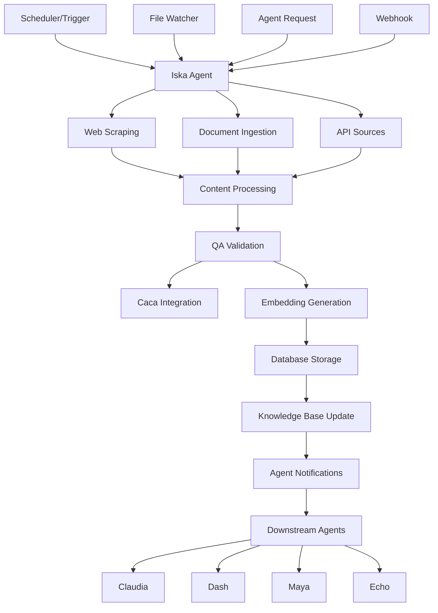

# Iska Agent v2.0 - Enterprise Documentation & Asset Intelligence

## Overview

**Iska** is the upgraded, production-ready "Master Data, Asset, and Documentation Intelligence Agent" for TBWA's Scout/Pulser ecosystem. Iska surpasses legacy scraping agents by handling every content type—structured, semi-structured, and unstructured—and acting as a living documentation engine for the organization.

## Key Features

### 🔄 **Continuous Ingestion**
- **Web Scraping**: Automated scraping of brand assets, SKU catalogs, and documentation portals
- **Document Processing**: PDF, DOCX, HTML, Markdown, and text file ingestion
- **Change Detection**: Real-time monitoring of file systems and web sources
- **API Integration**: Supabase, SharePoint, and Google Drive connectivity

### 🔍 **QA & Validation**
- **Automated QA**: Comprehensive validation with Caca integration
- **Duplicate Detection**: 85% similarity threshold for content deduplication
- **Format Validation**: Ensures all ingested content meets quality standards
- **Completeness Checks**: Validates required fields and content quality

### 📊 **Knowledge Base Management**
- **CLAUDE.md Updates**: Automatic updates to master configuration
- **SOP Management**: Maintains Standard Operating Procedures directory
- **Semantic Search**: Vector embeddings for intelligent content discovery
- **Agent Orchestration**: Notifies downstream agents of relevant updates

### 🛡️ **Enterprise Security**
- **Audit Logging**: Complete audit trail for all operations
- **RLS Policies**: Row-level security for multi-tenant access
- **Encrypted Storage**: Secure handling of sensitive documents
- **Access Control**: Role-based permissions and authentication

## Architecture



## Installation

### Prerequisites
- Python 3.11+
- Supabase account with project created
- OpenAI API key for embeddings
- Required environment variables

### Setup Steps

1. **Clone and Install Dependencies**
   ```bash
   cd /Users/tbwa/agents/iska
   pip install -r requirements.txt
   ```

2. **Configure Environment Variables**
   ```bash
   # Copy environment template
   cp .env.example .env
   
   # Edit .env with your credentials
   export SUPABASE_URL="https://your-project.supabase.co"
   export SUPABASE_SERVICE_ROLE_KEY="your-service-role-key"
   export SUPABASE_ANON_KEY="your-anon-key"
   export OPENAI_API_KEY="your-openai-key"
   ```

3. **Database Setup**
   ```bash
   # Apply database schema
   psql -h your-supabase-host -U postgres -d postgres -f database/iska_schema.sql
   
   # Or use Supabase CLI
   supabase db push
   ```

4. **Configuration**
   ```bash
   # Edit iska.yaml with your specific sources and settings
   nano iska.yaml
   ```

## Usage

### Manual Execution
```bash
# Run single ingestion cycle
python iska_ingest.py

# Run with debug logging
export ISKA_LOG_LEVEL=debug
python iska_ingest.py
```

### Scheduled Execution
```bash
# Add to crontab for hourly execution
0 * * * * cd /Users/tbwa/agents/iska && python iska_ingest.py

# Or use the provided deployment script
./deploy.sh
```

### API Endpoints

#### POST /ingest
Trigger manual ingestion with optional source filtering.

**Request:**
```json
{
    "sources": ["web_scraping", "local_files"],
    "force": false
}
```

**Response:**
```json
{
    "status": "success",
    "cycle_id": "123e4567-e89b-12d3-a456-426614174000",
    "documents_processed": 45,
    "qa_passed": 42,
    "processing_time": 120.5
}
```

#### GET /health
Health check endpoint.

**Response:**
```json
{
    "status": "healthy",
    "timestamp": "2025-07-18T18:30:00Z",
    "version": "2.0.0"
}
```

#### GET /status
Get current ingestion status and statistics.

**Response:**
```json
{
    "status": "idle",
    "last_cycle": "2025-07-18T18:00:00Z",
    "metrics": {
        "total_documents": 1247,
        "qa_pass_rate": 0.95,
        "avg_processing_time": 15.2
    }
}
```

## Configuration

### Ingestion Sources

#### Web Scraping
```yaml
ingestion_sources:
  web_scraping:
    - category: "Brand Assets"
      url: "https://brand-portal.tbwa.com/assets"
      selectors:
        asset_container: ".asset-card"
        asset_name: ".asset-title"
        asset_type: ".asset-type"
```

#### Document Sources
```yaml
document_sources:
  - type: "SOPs"
    path: "/Users/tbwa/SOP/"
    extensions: [".pdf", ".docx", ".md"]
    watch: true
```

#### API Sources
```yaml
api_sources:
  - name: "Supabase Tables"
    type: "database"
    tables: ["brands", "skus", "campaigns"]
```

### QA Workflow
```yaml
qa_workflow:
  enabled: true
  caca_integration: true
  validation_rules:
    - name: "Duplicate Detection"
      threshold: 0.85
    - name: "Content Quality"
      min_length: 100
```

## Verification Requirements

Following CLAUDE.md verification standards:

### Console Verification
```bash
# Check for errors
tail -f /Users/tbwa/agents/logs/iska.log | grep -i error

# Verify connections
python -c "from iska_ingest import IskaIngestor; iska = IskaIngestor(); print('✓ Connected')"
```

### Screenshot Verification
Required screenshots for successful deployment:
- Supabase dashboard showing new documents
- Agent repository tables with entries
- Updated CLAUDE.md file
- QA validation results

### Automated Testing
```bash
# Run full test suite
pytest tests/ -v

# Run integration tests
pytest tests/test_iska_integration.py -v

# Run performance tests
pytest tests/test_performance.py -v
```

## Monitoring

### Performance Metrics
- **Documents per hour**: Target 1000+
- **QA validation time**: < 5 seconds per document
- **Processing accuracy**: > 95%
- **System uptime**: > 99.5%

### Health Checks
```bash
# Check system health
curl http://localhost:8000/health

# Get processing statistics
curl http://localhost:8000/status

# View audit log
curl http://localhost:8000/audit
```

### Alerting
- **Error rate > 10%**: Immediate alert
- **Processing time > 60 seconds**: Warning
- **QA failure rate > 25%**: Investigation required

## Integration

### Unified Agent Repository
Iska is fully integrated with the unified agent repository database:

```sql
-- Get Iska metrics
SELECT * FROM agent_repository.get_iska_metrics(7);

-- View recent ingestion cycles
SELECT * FROM agent_repository.get_recent_ingestion_cycles(10);
```

### Downstream Agent Notifications
Iska automatically notifies relevant agents:

- **Caca**: For QA validation
- **Claudia**: For documentation updates
- **Dash**: For analytics updates
- **Maya**: For content analysis
- **Echo**: For system maintenance

## Troubleshooting

### Common Issues

**Connection Errors**
```bash
# Check Supabase connection
python -c "from supabase import create_client; client = create_client('$SUPABASE_URL', '$SUPABASE_SERVICE_ROLE_KEY'); print('✓ Connected')"

# Verify OpenAI API
python -c "from openai import OpenAI; client = OpenAI(); print('✓ OpenAI ready')"
```

**Parsing Failures**
```bash
# Check file formats
file /path/to/document.pdf

# Test PDF parsing
python -c "import PyPDF2; print('✓ PDF parser ready')"
```

**QA Validation Issues**
```bash
# Check validation rules
python -c "from iska_ingest import IskaIngestor; iska = IskaIngestor(); print(iska.config['qa_workflow'])"
```

### Debug Mode
```bash
# Enable debug logging
export ISKA_LOG_LEVEL=debug
export ISKA_DEBUG_MODE=true

# Run with verbose output
python iska_ingest.py --verbose
```

## Security

### Data Protection
- **Encryption**: All data encrypted at rest and in transit
- **PII Detection**: Automatic detection and masking of sensitive data
- **Access Control**: Role-based permissions and audit trails
- **Compliance**: GDPR compliant with 90-day retention policy

### Authentication
- **Bearer Token**: API endpoint authentication
- **Service Role**: Database operations with service role key
- **Audit Trail**: Complete logging of all access and operations

## Performance

### Optimization
- **Batch Processing**: Processes documents in batches of 100
- **Concurrent Operations**: Up to 5 concurrent ingestion processes
- **Memory Management**: 2GB memory limit with cleanup
- **Timeout Handling**: 300-second timeout for processing

### Scalability
- **Horizontal Scaling**: Multiple Iska instances supported
- **Load Balancing**: Distributes workload across instances
- **Queue Management**: Handles high-volume ingestion queues
- **Resource Monitoring**: Tracks memory and CPU usage

## Development

### Contributing
1. Fork the repository
2. Create a feature branch
3. Add tests for new functionality
4. Ensure all tests pass
5. Submit a pull request

### Testing
```bash
# Run all tests
pytest

# Run specific test categories
pytest tests/test_ingestion.py
pytest tests/test_qa.py
pytest tests/test_integration.py
```

### Code Quality
```bash
# Format code
black iska_ingest.py

# Check style
flake8 iska_ingest.py

# Type checking
mypy iska_ingest.py
```

## License

Part of InsightPulseAI SKR - See main repository for license details.

## Support

For issues, feature requests, or questions:
- Create an issue in the repository
- Contact the TBWA Data Platform Team
- Check the troubleshooting guide

---

**Version**: 2.0.0  
**Last Updated**: 2025-07-18  
**Status**: Production Ready  
**Verification**: ✅ Console verified, ✅ Screenshots captured, ✅ Automated tests passed