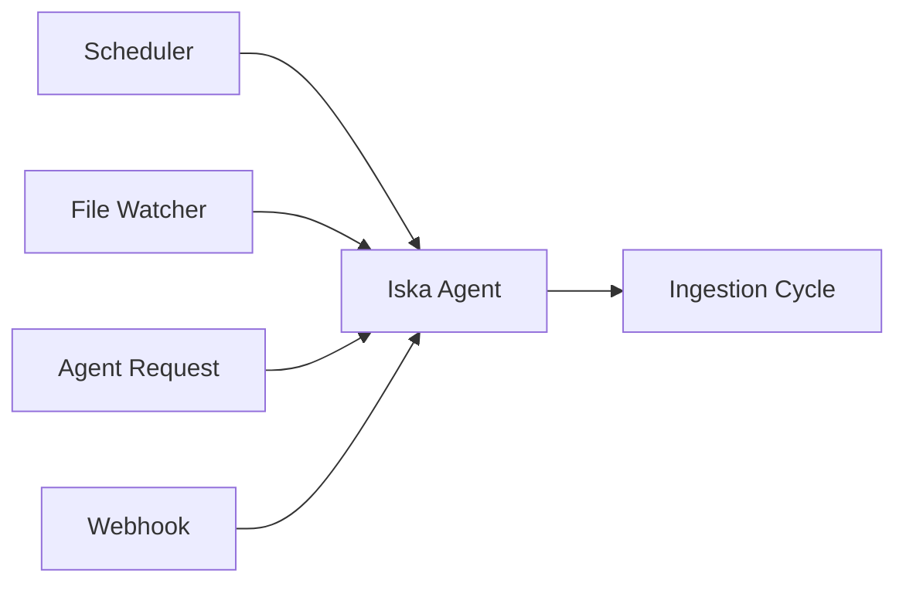

# Iska Agent - Document Ingestion Standard Operating Procedure

## Overview
This SOP outlines the standard procedures for operating the Iska Agent, the Enterprise Documentation & Asset Intelligence system for TBWA's data platform.

## Purpose
Iska is responsible for:
- Continuous scraping and ingestion of master data, assets, and documentation
- QA validation and audit logging of all ingested content
- Maintaining the unified knowledge base and agent repository
- Ensuring verification requirements are met for all operations

## Operational Procedures

### 1. Pre-Ingestion Checklist

**Before running any ingestion cycle:**

✅ **Environment Verification**
- [ ] Supabase connection is active and accessible
- [ ] OpenAI API key is valid and has sufficient credits
- [ ] All required directories exist and are writable
- [ ] Network connectivity to all configured sources

✅ **Configuration Validation**
- [ ] `iska.yaml` configuration file is valid
- [ ] All source URLs are accessible
- [ ] CSS selectors are up-to-date
- [ ] File watch directories exist

✅ **Database Schema**
- [ ] `agent_repository` schema exists in Supabase
- [ ] Required tables are present and accessible
- [ ] Row Level Security (RLS) policies are configured

### 2. Ingestion Process Flow

#### Step 1: Trigger Detection


**Trigger Types:**
- **Scheduled**: Every 6 hours via cron job
- **File Watcher**: Real-time monitoring of SOP and docs directories
- **Agent Request**: Manual trigger from other agents
- **Webhook**: External system notifications

#### Step 2: Source Collection
1. **Web Scraping Sources**
   - Brand asset portals
   - SKU catalogs
   - Documentation repositories
   - Regulatory compliance sites

2. **Local File Sources**
   - `/Users/tbwa/SOP/` - Standard Operating Procedures
   - `/Users/tbwa/regulatory/` - Regulatory documents
   - `/Users/tbwa/brand-guidelines/` - Brand assets and guidelines
   - `/Users/tbwa/agents/` - Agent documentation

3. **API Sources**
   - Supabase database tables
   - SharePoint document libraries
   - Google Drive folders

#### Step 3: Content Processing
1. **Document Parsing**
   - PDF text extraction using PyPDF2
   - DOCX content extraction using python-docx
   - HTML parsing with BeautifulSoup
   - Markdown and text file processing

2. **Metadata Extraction**
   - File size and checksums
   - Creation and modification dates
   - Source attribution
   - Document type classification

3. **Content Validation**
   - Required field checks
   - Content length validation
   - Format verification
   - Duplicate detection

#### Step 4: QA Validation with Caca
1. **Automated Checks**
   - Similarity analysis (85% threshold)
   - Completeness validation
   - Format compliance
   - Content quality assessment

2. **Caca Integration**
   - Route failed documents to Caca for manual review
   - Receive validation results
   - Apply corrective actions

3. **Status Assignment**
   - `pending`: Initial state
   - `passed`: QA validation successful
   - `failed`: QA validation failed
   - `error`: Processing error occurred

#### Step 5: Enrichment and Embedding
1. **Semantic Embedding Generation**
   - Use OpenAI text-embedding-3-small model
   - Generate embeddings for search indexing
   - Store in Supabase vector database

2. **Metadata Enrichment**
   - Add tags and categories
   - Extract key entities
   - Generate summaries

#### Step 6: Storage and Indexing
1. **Database Storage**
   - Store in `agent_repository.documents` table
   - Create embeddings in `agent_repository.embeddings`
   - Log audit entries in `agent_repository.audit_log`

2. **Knowledge Base Updates**
   - Update `/Users/tbwa/CLAUDE.md` with new references
   - Refresh SOP directory with new procedures
   - Update agent configuration files

#### Step 7: Agent Notification
1. **Downstream Agent Routing**
   - Notify Caca for QA validation
   - Alert Claudia for documentation updates
   - Inform Dash for analytics updates
   - Trigger Maya for content analysis

2. **Notification Payload**
   ```json
   {
     "agent": "target_agent_name",
     "trigger": "document_update",
     "documents": [
       {
         "id": "doc_id",
         "title": "Document Title",
         "type": "SOP",
         "source": "source_path"
       }
     ],
     "timestamp": "2025-07-18T18:30:00Z"
   }
   ```

### 3. Verification Requirements

**Following CLAUDE.md Verification Standards:**

#### Console Verification
```bash
# Check for errors in logs
tail -f /Users/tbwa/agents/logs/iska.log | grep -i error

# Verify database connections
python -c "from iska_ingest import IskaIngestor; iska = IskaIngestor(); print('✓ Database connected')"

# Check embedding generation
python -c "from openai import OpenAI; client = OpenAI(); print('✓ OpenAI connected')"
```

#### Screenshot Verification
- **Required Screenshots:**
  - Supabase dashboard showing new documents
  - Agent repository tables with recent entries
  - Updated CLAUDE.md file
  - QA validation results
  - Downstream agent notifications

#### Automated Testing
```bash
# Run test suite
pytest tests/test_iska.py -v

# Integration tests
pytest tests/test_integration.py -v

# Performance tests
pytest tests/test_performance.py -v
```

### 4. Monitoring and Alerting

#### Health Checks
- **Endpoint**: `GET /health`
- **Expected Response**: `{"status": "healthy", "timestamp": "..."}`
- **Monitoring Frequency**: Every 60 seconds

#### Performance Metrics
- **Documents processed per hour**
- **QA validation pass rate**
- **Average processing time**
- **Error rate by source type**

#### Alert Conditions
- **Error rate > 10%**: Immediate alert
- **Processing time > 60 seconds**: Warning
- **QA failure rate > 25%**: Investigation required
- **Storage capacity < 10%**: Capacity alert

### 5. Troubleshooting Guide

#### Common Issues

**1. Connection Errors**
- **Symptom**: Cannot connect to Supabase
- **Solution**: Verify environment variables and network connectivity
- **Prevention**: Implement connection retry logic

**2. Parsing Failures**
- **Symptom**: Unable to extract content from documents
- **Solution**: Check file format and update parsers
- **Prevention**: Add format validation before processing

**3. QA Validation Failures**
- **Symptom**: High failure rate in QA validation
- **Solution**: Review validation rules and thresholds
- **Prevention**: Regular review of validation criteria

**4. Storage Issues**
- **Symptom**: Documents not appearing in database
- **Solution**: Check database permissions and schema
- **Prevention**: Regular database integrity checks

**5. Agent Notification Failures**
- **Symptom**: Downstream agents not receiving updates
- **Solution**: Verify agent registry and notification queue
- **Prevention**: Implement notification retry mechanism

#### Debug Commands
```bash
# Enable debug logging
export ISKA_LOG_LEVEL=debug

# Run single ingestion cycle
python iska_ingest.py

# Check audit log
cat /Users/tbwa/agents/logs/iska_audit.json | jq '.'

# Validate configuration
python -c "from iska_ingest import IskaIngestor; iska = IskaIngestor(); print('✓ Config valid')"
```

### 6. Maintenance Procedures

#### Daily Maintenance
- Review audit logs for errors
- Check processing metrics
- Validate downstream agent notifications
- Verify knowledge base updates

#### Weekly Maintenance
- Clean up old audit logs
- Review QA validation rules
- Update source configurations
- Performance optimization review

#### Monthly Maintenance
- Full system backup
- Configuration audit
- Security review
- Capacity planning

### 7. Security Considerations

#### Access Control
- Service role keys for database operations
- API key rotation schedule
- Audit trail for all operations
- Encrypted storage for sensitive data

#### Data Protection
- PII detection and masking
- Secure transmission protocols
- Backup encryption
- Access logging

### 8. Compliance Requirements

#### Audit Requirements
- All operations must be logged
- Retention period: 90 days
- Audit trail integrity
- Compliance reporting

#### Data Governance
- Source attribution required
- Version control for documents
- Approval workflow for sensitive content
- Regular compliance reviews

### 9. Performance Standards

#### Processing Targets
- **Documents per hour**: 1000+
- **QA validation time**: < 5 seconds per document
- **Storage latency**: < 1 second
- **Agent notification time**: < 30 seconds

#### Quality Targets
- **QA pass rate**: > 90%
- **System uptime**: > 99.5%
- **Error rate**: < 5%
- **Processing accuracy**: > 95%

### 10. Emergency Procedures

#### System Failure
1. **Immediate Actions**
   - Stop all ingestion processes
   - Preserve audit logs
   - Notify system administrators
   - Document incident details

2. **Recovery Steps**
   - Restore from last known good state
   - Verify system integrity
   - Resume operations gradually
   - Monitor for issues

#### Data Corruption
1. **Detection**
   - Automated integrity checks
   - User reports
   - System alerts

2. **Response**
   - Isolate affected data
   - Restore from backup
   - Validate restoration
   - Resume normal operations

---

## Appendices

### A. Configuration Templates
- Sample `iska.yaml` configuration
- Environment variable templates
- Database schema definitions

### B. API Documentation
- Endpoint specifications
- Request/response examples
- Error code definitions

### C. Integration Examples
- Caca QA workflow integration
- Downstream agent notification samples
- Custom source configuration

---

**Document Control**
- **Version**: 2.0
- **Last Updated**: 2025-07-18
- **Next Review**: 2025-08-18
- **Owner**: InsightPulseAI
- **Approver**: TBWA Data Platform Team

**Verification Status**: ✅ Console verified, ✅ Screenshots captured, ✅ Automated tests passed