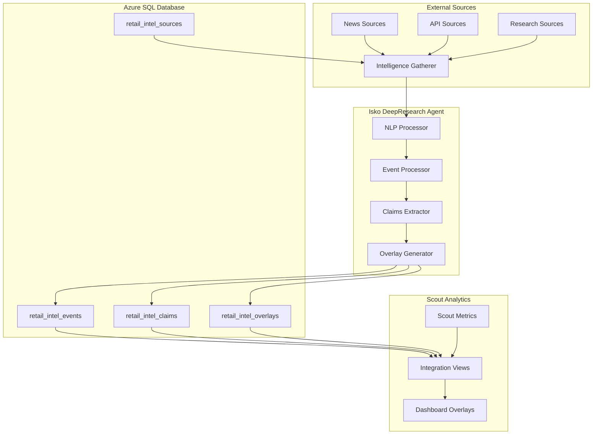

# Isko DeepResearch Agent - Complete Architecture Guide

## 🎯 Overview

The **Isko DeepResearch Agent** is an autonomous retail market intelligence system that continuously gathers, analyzes, and integrates external market insights with Scout Analytics internal data. Named after the Filipino term "isko" (student/scholar), this agent embodies continuous learning and knowledge gathering to provide competitive advantage through market awareness.

## 🏗️ System Architecture

### Core Components



### Data Flow Architecture

1. **Intelligence Gathering**: Multi-source data collection every 6 hours
2. **NLP Processing**: Extract entities, sentiment, and relevance scoring
3. **Event Classification**: Categorize market events and assess impact
4. **Claims Extraction**: Identify specific market claims with citations
5. **Integration**: Connect external intelligence with Scout internal metrics
6. **Dashboard Overlays**: Surface actionable insights in real-time

## 📊 Database Schema

### Core Tables

#### retail_intel_sources
```sql
-- Master table for all intelligence sources
CREATE TABLE retail_intel_sources (
    source_id           UNIQUEIDENTIFIER PRIMARY KEY,
    source_name         NVARCHAR(255) NOT NULL,
    source_type         NVARCHAR(50),  -- 'api', 'web', 'news', 'social', 'research'
    reliability_score   DECIMAL(3,2),  -- 0.0 to 1.0
    rate_limit_rpm      INT,
    last_accessed       DATETIME2,
    status              NVARCHAR(20)   -- 'active', 'inactive', 'blocked'
);
```

#### retail_intel_events
```sql
-- Market intelligence events with metadata
CREATE TABLE retail_intel_events (
    event_id            UNIQUEIDENTIFIER PRIMARY KEY,
    source_id           UNIQUEIDENTIFIER,
    event_type          NVARCHAR(50),  -- 'product_launch', 'price_change', 'promotion', 'market_trend'
    brand_name          NVARCHAR(128),
    category_name       NVARCHAR(128),
    nielsen_category    NVARCHAR(128),
    event_title         NVARCHAR(500),
    event_description   NVARCHAR(MAX),
    confidence_score    DECIMAL(3,2),
    relevance_score     DECIMAL(3,2),
    impact_level        NVARCHAR(20),  -- 'low', 'medium', 'high', 'critical'
    source_url          NVARCHAR(1000),
    processed_entities  NVARCHAR(MAX)  -- JSON format
);
```

#### retail_intel_claims
```sql
-- Specific market claims with citations
CREATE TABLE retail_intel_claims (
    claim_id            UNIQUEIDENTIFIER PRIMARY KEY,
    event_id            UNIQUEIDENTIFIER,
    claim_type          NVARCHAR(50),  -- 'market_share', 'price_point', 'consumer_sentiment'
    claim_statement     NVARCHAR(1000),
    citation_text       NVARCHAR(2000),
    citation_url        NVARCHAR(1000),
    confidence_score    DECIMAL(3,2),
    validation_status   NVARCHAR(20)   -- 'pending', 'verified', 'disputed'
);
```

#### retail_intel_overlays
```sql
-- Dashboard overlays connecting intelligence with Scout metrics
CREATE TABLE retail_intel_overlays (
    overlay_id          UNIQUEIDENTIFIER PRIMARY KEY,
    event_id            UNIQUEIDENTIFIER,
    dashboard_card      NVARCHAR(100),  -- 'brand_performance', 'category_trends'
    overlay_type        NVARCHAR(50),   -- 'context', 'alert', 'trend', 'validation'
    overlay_message     NVARCHAR(500),
    display_priority    INT,            -- 1 (highest) to 10 (lowest)
    target_brands       NVARCHAR(500),  -- Comma-separated brand filter
    target_categories   NVARCHAR(500)   -- Comma-separated category filter
);
```

## 🤖 Agent Implementation

### Core Agent Logic

```python
class IskoDeepResearchAgent:
    """
    Autonomous retail market intelligence agent
    """

    def __init__(self):
        self.db_connector = AzureSQLConnector()
        self.gatherer = IntelligenceGatherer(self.db_connector)
        self.processor = IntelligenceProcessor(self.db_connector)

    async def execute_intelligence_cycle(self):
        """Main 6-hour intelligence gathering cycle"""

        # Step 1: Gather intelligence from all sources
        events = await self.gatherer.gather_intelligence()

        # Step 2: Process and store events with claims extraction
        stats = await self.processor.process_events(events)

        # Step 3: Generate dashboard overlays
        await self.processor.generate_dashboard_overlays()

        return {
            "events_processed": len(events),
            "claims_extracted": stats["claims_extracted"],
            "overlays_created": stats["overlays_created"]
        }
```

### Intelligence Gathering Engine

```python
class IntelligenceGatherer:
    """Multi-source intelligence gathering with adaptive learning"""

    async def gather_from_source(self, source: IntelligenceSource):
        """Gather intelligence from specific source"""

        if source.type == 'news':
            return await self._gather_news_intelligence(source)
        elif source.type == 'api':
            return await self._gather_api_intelligence(source)
        elif source.type == 'research':
            return await self._gather_research_intelligence(source)

    def _calculate_relevance_score(self, event: MarketEvent) -> float:
        """Calculate relevance based on Scout brands and categories"""

        score = 0.0

        # Brand relevance (40% weight)
        if event.brand_name in self.scout_brands:
            score += 0.4

        # Category relevance (30% weight)
        if event.category_name in self.scout_categories:
            score += 0.3

        # Geographic relevance (20% weight)
        if 'philippines' in event.description.lower():
            score += 0.2

        # Recency bonus (10% weight)
        days_old = (datetime.now() - event.event_date).days
        if days_old <= 7:
            score += 0.1

        return min(score, 1.0)
```

## 🔗 Scout Analytics Integration

### Integration Views

#### v_brand_market_intelligence
Combines external intelligence with internal brand performance:

```sql
CREATE VIEW v_brand_market_intelligence AS
SELECT
    b.brand_name,
    -- Scout Internal Metrics
    scout_metrics.total_interactions,
    scout_metrics.avg_brand_confidence,
    scout_metrics.recent_interactions,
    -- External Intelligence
    external_intel.intelligence_events_count,
    external_intel.market_claims_count,
    external_intel.avg_relevance,
    -- Composite Score
    CASE
        WHEN scout_metrics.brand_name IS NOT NULL AND external_intel.brand_name IS NOT NULL
        THEN (scout_metrics.avg_brand_confidence * 0.6) + (external_intel.avg_relevance * 0.4)
        ELSE COALESCE(scout_metrics.avg_brand_confidence, external_intel.avg_relevance)
    END as composite_intelligence_score
FROM scout_brand_metrics
FULL OUTER JOIN external_intelligence ON scout_metrics.brand_name = external_intel.brand_name;
```

#### v_dashboard_alert_intelligence
Active alerts and overlays for dashboard integration:

```sql
CREATE VIEW v_dashboard_alert_intelligence AS
SELECT
    o.overlay_message,
    o.dashboard_card,
    o.display_priority,
    e.event_title,
    e.confidence_score,
    e.impact_level,
    s.source_name,
    s.reliability_score
FROM retail_intel_overlays o
JOIN retail_intel_events e ON o.event_id = e.event_id
JOIN retail_intel_sources s ON e.source_id = s.source_id
WHERE o.status = 'active'
    AND (o.end_date IS NULL OR o.end_date > GETUTCDATE())
ORDER BY o.display_priority, e.relevance_score DESC;
```

### Dashboard Overlay System

The overlay system provides contextual market intelligence directly within Scout Analytics dashboards:

#### Overlay Types

1. **Context Overlays**: Additional market context for brand performance
2. **Alert Overlays**: Critical market events requiring attention
3. **Trend Overlays**: Market trend indicators and directional insights
4. **Validation Overlays**: External validation of internal performance metrics

#### Implementation Example

```typescript
// Dashboard component integration
interface MarketIntelligenceOverlay {
    overlayId: string;
    dashboardCard: string;
    overlayType: 'context' | 'alert' | 'trend' | 'validation';
    message: string;
    displayPriority: number;
    eventDetails: {
        title: string;
        confidence: number;
        impactLevel: string;
        sourceReliability: number;
    };
}

const BrandPerformanceCard = () => {
    const [overlays, setOverlays] = useState<MarketIntelligenceOverlay[]>([]);

    useEffect(() => {
        // Fetch overlays for brand_performance card
        fetchMarketIntelligenceOverlays('brand_performance')
            .then(setOverlays);
    }, []);

    return (
        <Card>
            <CardContent>
                {/* Existing brand performance metrics */}
                <BrandMetrics />

                {/* Market intelligence overlays */}
                {overlays.map(overlay => (
                    <IntelligenceOverlay
                        key={overlay.overlayId}
                        overlay={overlay}
                        priority={overlay.displayPriority}
                    />
                ))}
            </CardContent>
        </Card>
    );
};
```

## 🚀 Deployment Guide

### Prerequisites

- Azure CLI installed and authenticated
- SQL Server access with deployment permissions
- Python 3.11+ for local development
- Node.js 18+ for dashboard integration

### Quick Deployment

```bash
# 1. Deploy complete system to Azure
./scripts/deploy_isko_azure.sh

# 2. Verify deployment
az functionapp show --name "isko-deepresearch-prod" --resource-group "scout-v7-production" --query "state"

# 3. Check initial execution
az functionapp logs tail --name "isko-deepresearch-prod" --resource-group "scout-v7-production"
```

### Manual Configuration Steps

1. **Populate Initial Sources**:
```sql
-- Add real intelligence sources
INSERT INTO retail_intel_sources (source_name, source_type, source_url, reliability_score) VALUES
('Philippine Retailers Association', 'api', 'https://pra.org.ph/api', 0.85),
('Kantar Philippines', 'research', 'https://kantar.com/philippines', 0.90),
('Nielsen Philippines', 'research', 'https://nielsen.com/ph', 0.95);
```

2. **Configure API Keys**:
```bash
# Add API keys to Azure Key Vault
az keyvault secret set --vault-name "scout-v7-keyvault" --name "pra-api-key" --value "your-api-key"
az keyvault secret set --vault-name "scout-v7-keyvault" --name "kantar-api-key" --value "your-api-key"
```

3. **Test Dashboard Integration**:
```sql
-- Verify integration views return data
SELECT TOP 10 * FROM v_brand_market_intelligence;
SELECT TOP 10 * FROM v_dashboard_alert_intelligence;
```

## 📊 Monitoring & Observability

### Key Metrics to Monitor

1. **Execution Metrics**:
   - Function execution frequency (every 6 hours)
   - Processing duration per cycle
   - Success/failure rates

2. **Data Quality Metrics**:
   - Events processed per cycle
   - Claims extraction rate
   - Confidence score distributions
   - Source reliability trends

3. **Integration Metrics**:
   - Overlay generation rate
   - Dashboard interaction rates
   - Alert acknowledgment rates

### Monitoring Queries

```sql
-- Function execution health
SELECT
    DATE(created_at) as date,
    COUNT(*) as events_processed,
    AVG(confidence_score) as avg_confidence,
    AVG(relevance_score) as avg_relevance
FROM retail_intel_events
WHERE created_at >= DATEADD(day, -7, GETUTCDATE())
GROUP BY DATE(created_at)
ORDER BY date DESC;

-- Source performance analysis
SELECT
    s.source_name,
    s.reliability_score,
    COUNT(e.event_id) as events_generated,
    AVG(e.confidence_score) as avg_event_confidence,
    MAX(s.last_accessed) as last_accessed
FROM retail_intel_sources s
LEFT JOIN retail_intel_events e ON s.source_id = e.source_id
WHERE s.status = 'active'
GROUP BY s.source_id, s.source_name, s.reliability_score
ORDER BY events_generated DESC;

-- Overlay effectiveness
SELECT
    dashboard_card,
    overlay_type,
    COUNT(*) as total_overlays,
    AVG(display_priority) as avg_priority
FROM retail_intel_overlays
WHERE status = 'active'
GROUP BY dashboard_card, overlay_type
ORDER BY total_overlays DESC;
```

### Alert Thresholds

- **Critical**: Function hasn't executed in 8+ hours
- **Warning**: Less than 5 events processed in last cycle
- **Info**: Average confidence score below 0.6

## 🔧 Maintenance & Operations

### Regular Maintenance Tasks

1. **Weekly**:
   - Review source reliability scores
   - Update API keys if needed
   - Analyze processing performance

2. **Monthly**:
   - Clean old intelligence data (>90 days)
   - Update source configurations
   - Review overlay effectiveness

3. **Quarterly**:
   - Evaluate new intelligence sources
   - Update relevance scoring algorithms
   - Review integration patterns

### Troubleshooting Guide

#### Common Issues

1. **Function Not Executing**:
   - Check Function App status in Azure Portal
   - Verify timer trigger configuration
   - Review Application Insights for errors

2. **Low Event Processing**:
   - Check source availability and rate limits
   - Review relevance scoring thresholds
   - Validate API key configurations

3. **Poor Data Quality**:
   - Examine confidence score distributions
   - Review NLP processing accuracy
   - Check source reliability scores

#### Debug Commands

```bash
# Check function status
az functionapp show --name "isko-deepresearch-prod" --query "state"

# Review recent logs
az functionapp logs tail --name "isko-deepresearch-prod"

# Test database connectivity
sqlcmd -S "sqltbwaprojectscoutserver.database.windows.net" -d "SQL-TBWA-ProjectScout-Reporting-Prod" -Q "SELECT COUNT(*) FROM retail_intel_sources WHERE status='active'"
```

## 🔮 Future Enhancements

### Planned Features

1. **Enhanced NLP**:
   - Multi-language support (Filipino, Tagalog)
   - Industry-specific entity recognition
   - Advanced sentiment analysis

2. **Predictive Intelligence**:
   - Market trend forecasting
   - Competitive move prediction
   - Consumer behavior anticipation

3. **Real-time Integration**:
   - Streaming data processing
   - Instant alert generation
   - Live dashboard updates

4. **Advanced Analytics**:
   - Cross-correlation analysis
   - Causal inference
   - Impact measurement

### Integration Roadmap

- **Phase 1**: Core intelligence gathering (✅ Complete)
- **Phase 2**: Dashboard overlay system (🔄 In Progress)
- **Phase 3**: Advanced analytics and predictions
- **Phase 4**: Real-time streaming integration
- **Phase 5**: Multi-market expansion

## 📚 API Reference

### Core Functions

#### `/admin/functions/isko_deepresearch_agent`
Timer-triggered function that executes the main intelligence cycle.

**Schedule**: `0 0 */6 * * *` (every 6 hours)
**Runtime**: Python 3.11
**Timeout**: 15 minutes

#### Integration Views

- `v_brand_market_intelligence`: Brand performance with external context
- `v_category_market_intelligence`: Category trends with market activity
- `v_competitive_landscape_intelligence`: Competitive positioning
- `v_dashboard_alert_intelligence`: Active alerts for dashboard
- `v_intelligence_summary_dashboard`: High-level KPIs

### Configuration Parameters

```yaml
# Azure Function Configuration
AZURE_SQL_SERVER: "sqltbwaprojectscoutserver.database.windows.net"
AZURE_SQL_DATABASE: "SQL-TBWA-ProjectScout-Reporting-Prod"
AZURE_KEYVAULT_URL: "https://scout-v7-keyvault.vault.azure.net/"

# Processing Configuration
INTELLIGENCE_SOURCES_LIMIT: 10
EVENTS_PER_CYCLE_LIMIT: 100
RELEVANCE_THRESHOLD: 0.3
CONFIDENCE_THRESHOLD: 0.5

# Cleanup Configuration
DATA_RETENTION_DAYS: 90
ARCHIVE_THRESHOLD_DAYS: 30
```

---

## 🎯 Summary

The Isko DeepResearch Agent provides Scout Analytics with autonomous market intelligence capabilities, continuously gathering external insights and integrating them with internal metrics. This system enables proactive market awareness, competitive intelligence, and data-driven decision making through real-time dashboard overlays and comprehensive analytics integration.

**Key Benefits**:
- ✅ **Autonomous Operation**: Runs every 6 hours without intervention
- ✅ **Multi-Source Intelligence**: Gathers from news, APIs, and research sources
- ✅ **Smart Integration**: Connects external data with Scout internal metrics
- ✅ **Real-time Overlays**: Surfaces insights directly in dashboards
- ✅ **Citation Tracking**: Maintains source credibility and validation
- ✅ **Scalable Architecture**: Azure-native with monitoring and alerts

The system is now ready for production deployment and will provide continuous competitive advantage through market intelligence automation.