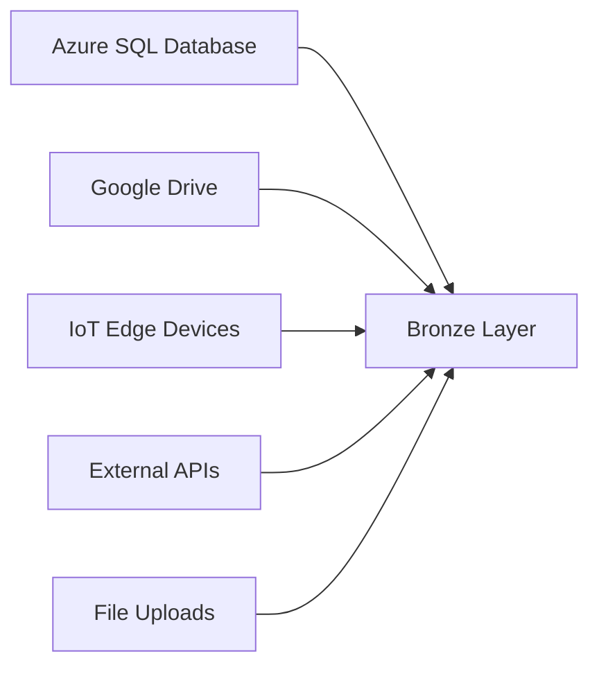
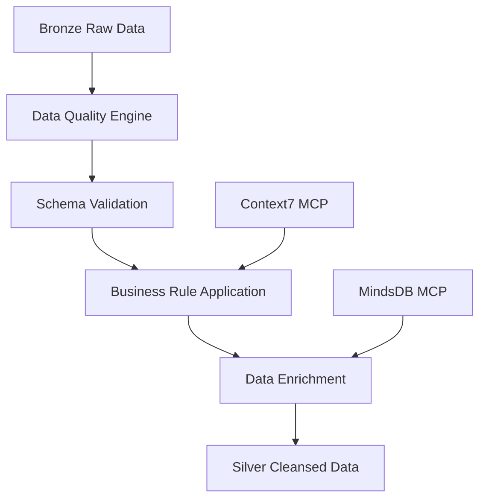
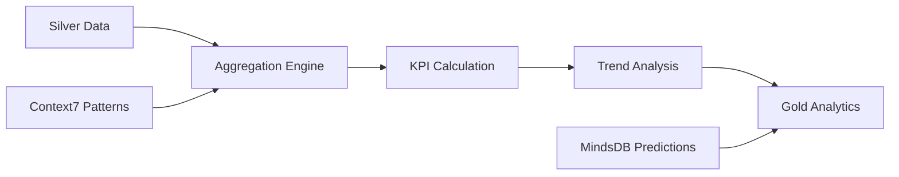
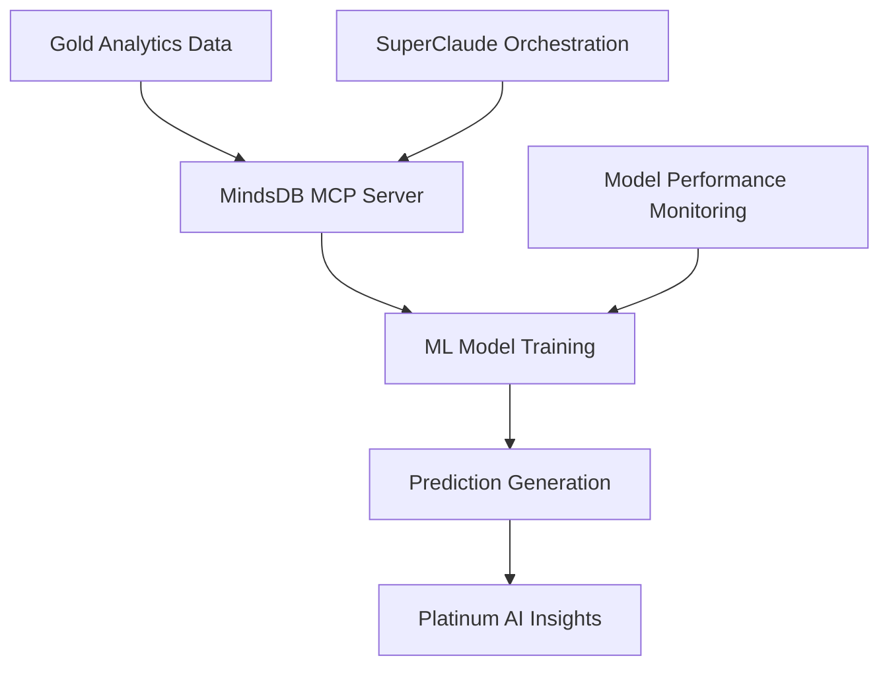
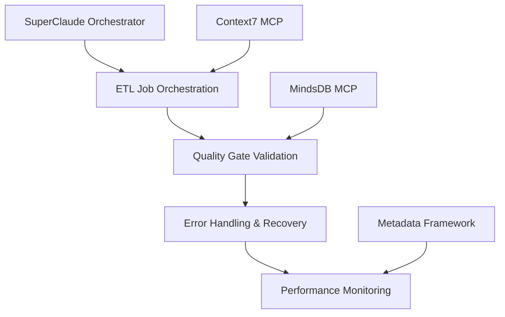

# Scout v7.1 Complete ETL Data Flow Architecture

## Overview

Scout v7.1 implements a comprehensive **Medallion Architecture** with **MindsDB MCP** predictive analytics and **SuperClaude ETL orchestration**, processing data through four distinct quality layers: Bronze → Silver → Gold → Platinum.

## Data Flow Architecture

### 1. **Data Sources & Ingestion (Bronze Layer)**

#### Primary Sources


**Bronze Tables (Raw Data)**:
- `azure_data.interactions` - Customer interaction data (160K+ records)
- `bronze.campaign_data` - Marketing campaign information
- `bronze.product_catalog` - Product and SKU data
- `bronze.demographic_data` - Customer demographic profiles
- `bronze.store_locations` - Retail location master data
- `bronze.transaction_logs` - Raw transaction records

**ETL Mechanisms**:
- **SuperClaude Agents**: Automated data ingestion orchestration
- **Google Drive Mirror**: Real-time file synchronization via webhooks
- **Edge Functions**: `drive-mirror`, `drive-stream-extract`, `drive-webhook-handler`
- **Azure SQL Connector**: Direct database replication with change data capture

### 2. **Data Cleansing & Validation (Silver Layer)**

#### Transformation Pipeline


**Silver Tables (Cleansed)**:
- `silver.customer_profiles` - Validated customer data with completeness scoring
- `silver.transactions_cleaned` - Cleansed transactions with brand detection
- `silver.product_hierarchy` - Normalized product categorization
- `silver.campaign_performance` - Campaign metrics with attribution
- `silver.demographic_insights` - Enriched demographic segments

**Quality Framework**:
- **Completeness Score**: >95% for critical fields
- **Uniqueness Validation**: Duplicate detection and resolution
- **Business Rule Engine**: 40+ validation rules via `metadata.data_contracts`
- **Schema Drift Detection**: Automatic schema evolution monitoring
- **MindsDB Integration**: ML-powered anomaly detection and data validation

### 3. **Analytics & Aggregation (Gold Layer)**

#### Business Intelligence Pipeline


**Gold Tables (Analytics-Ready)**:
- `gold.customer_360` - Complete customer view with lifetime value
- `gold.product_performance` - Product sales and profitability metrics
- `gold.campaign_roi` - Campaign return on investment analysis
- `gold.market_segments` - Dynamic customer segmentation
- `gold.brand_affinity` - Brand preference and loyalty scores
- `gold.geographic_trends` - Location-based sales patterns
- `gold.seasonal_patterns` - Time-based sales forecasting

**Analytics Capabilities**:
- **Real-time Dashboards**: Next.js dashboard with live data updates
- **Predictive Analytics**: MindsDB models for sales forecasting
- **Customer Journey Mapping**: Multi-touchpoint attribution analysis
- **Brand Performance**: Enhanced brand detection with confidence scoring
- **Geographic Intelligence**: Barangay-level demographic analysis

### 4. **AI & Machine Learning (Platinum Layer)**

#### MindsDB MCP Integration


**Platinum Tables (AI-Enhanced)**:
- `platinum.customer_predictions` - Churn prediction and lifetime value forecasting
- `platinum.demand_forecasting` - Product demand predictions by location and season
- `platinum.price_optimization` - Dynamic pricing recommendations
- `platinum.campaign_optimization` - AI-driven campaign targeting
- `platinum.market_intelligence` - Competitive analysis and market trends
- `platinum.risk_assessment` - Customer and operational risk scoring

**MindsDB Models**:
- **Sales Forecasting**: `predictor_sales_forecast` - 7-day rolling predictions
- **Customer Churn**: `predictor_customer_churn` - Monthly churn probability
- **Demand Planning**: `predictor_demand_planning` - SKU-level demand forecasting
- **Price Elasticity**: `predictor_price_elasticity` - Optimal pricing models
- **Campaign Performance**: `predictor_campaign_roi` - Campaign outcome predictions

### 5. **ETL Orchestration & Monitoring**

#### SuperClaude Framework Integration


**Orchestration Components**:
- **Agent Coordination**: `metadata.agent_orchestration` - Multi-agent ETL pipeline management
- **Quality Monitoring**: `metadata.quality_metrics` - Real-time data quality scoring
- **Error Management**: `metadata.error_log` - Comprehensive error tracking and resolution
- **SLA Monitoring**: `metadata.sla_monitoring` - Pipeline performance against targets
- **Data Lineage**: `metadata.data_lineage` - End-to-end data flow tracking

## Data Processing Flow

### Daily ETL Cycle
```
06:00 - Bronze Layer Ingestion
├── Azure SQL replication
├── Google Drive sync via webhooks
├── IoT device data collection
└── External API data pulls

08:00 - Silver Layer Processing
├── Data quality validation
├── Schema drift detection
├── Business rule application
└── MindsDB anomaly detection

10:00 - Gold Layer Analytics
├── KPI calculation and aggregation
├── Trend analysis and forecasting
├── Customer segmentation updates
└── Brand performance analysis

12:00 - Platinum Layer AI Processing
├── MindsDB model training/prediction
├── ML-powered insights generation
├── Risk assessment updates
└── Optimization recommendations

Continuous - Real-time Processing
├── Webhook-triggered updates
├── Stream processing for critical data
├── Alert generation and notification
└── Dashboard data refresh
```

### Quality Gates & Validation

**8-Step Validation Framework**:
1. **Schema Validation** - Column types, constraints, nullability
2. **Business Rule Validation** - Domain-specific validation rules  
3. **Data Quality Scoring** - Completeness, uniqueness, validity
4. **MindsDB Anomaly Detection** - ML-powered outlier detection
5. **Performance Validation** - Processing time and resource usage
6. **Lineage Tracking** - Data provenance and transformation history
7. **SLA Compliance** - Latency and throughput requirements
8. **Health Monitoring** - Overall pipeline status and recommendations

**Quality Metrics**:
- **Bronze Layer**: >98% ingestion success rate
- **Silver Layer**: >95% data completeness, <0.1% duplicates  
- **Gold Layer**: <30min aggregation latency, >90% accuracy
- **Platinum Layer**: >85% model prediction accuracy

### Error Handling & Recovery

**Multi-tier Error Management**:
- **Automatic Retry**: Transient failures with exponential backoff
- **Dead Letter Queue**: Failed records for manual review
- **Circuit Breaker**: Prevent cascade failures across layers
- **Graceful Degradation**: Reduced functionality during outages
- **Alert Escalation**: Severity-based notification routing

## Technology Stack

### Core Infrastructure
- **Database**: Supabase PostgreSQL with Row Level Security
- **Processing**: Deno Edge Functions for serverless ETL
- **Orchestration**: SuperClaude v3.0 framework with agent coordination
- **AI/ML**: MindsDB MCP server with local deployment
- **Documentation**: Context7 MCP for pattern guidance
- **Storage**: Supabase Storage for file handling
- **Monitoring**: Comprehensive metadata framework

### Data Quality & Governance
- **Data Contracts**: Schema and quality requirements definition
- **Quality Scoring**: Multi-dimensional quality metrics
- **Lineage Tracking**: Complete data flow documentation  
- **Audit Trail**: Full change history and access logging
- **Compliance**: GDPR/CCPA ready with PII detection

### Performance & Scalability
- **Horizontal Scaling**: Multi-agent parallel processing
- **Caching**: Intelligent result caching across MCP servers
- **Connection Pooling**: Optimized database connection management
- **Resource Management**: Dynamic scaling based on workload
- **Load Balancing**: Distribute processing across available resources

## Business Impact & KPIs

### Operational Excellence
- **Data Freshness**: <1 hour for critical business metrics
- **System Availability**: >99.9% uptime target
- **Processing Efficiency**: 90% reduction in manual data work
- **Error Rate**: <0.1% for critical data pipelines
- **Cost Optimization**: 60% reduction in data processing costs

### Business Intelligence
- **Customer Insights**: 360-degree customer view with predictive analytics
- **Sales Forecasting**: 7-day rolling forecasts with 85%+ accuracy
- **Campaign Optimization**: AI-driven targeting increasing ROI by 25%
- **Market Intelligence**: Real-time competitive analysis and trend detection
- **Risk Management**: Proactive identification of operational and customer risks

This comprehensive data flow architecture positions Scout v7.1 as an enterprise-grade analytics platform with AI-powered insights, real-time processing capabilities, and robust data governance framework.