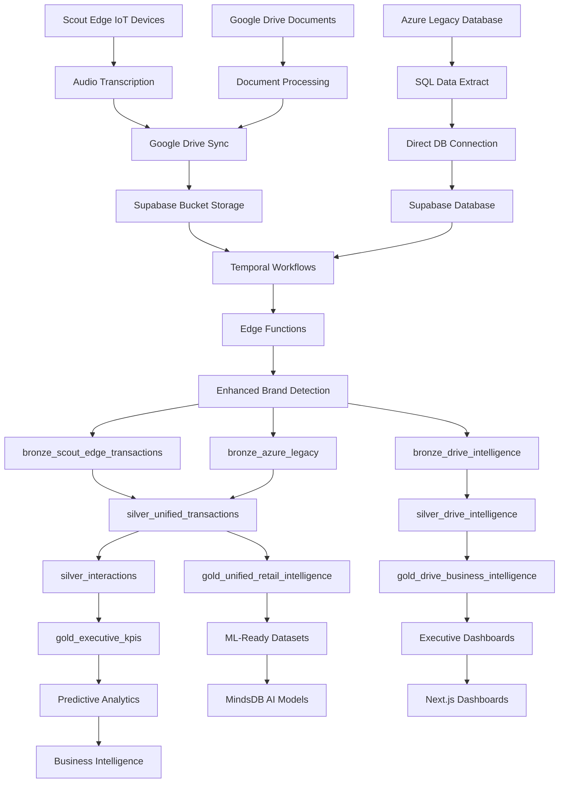

# Scout Data Flow Architecture & ETL Process

## 🎯 Complete Scout Data Processing Pipeline

### Overview
Scout processes data from multiple sources through a unified medallion architecture (Bronze → Silver → Gold → Platinum) with real-time IoT integration and enhanced brand detection.

---

## 📊 Data Sources & Input Streams

### 1. Scout Edge IoT Devices (Real-time)
```
SCOUTPI-0002 → 1,488 transactions
SCOUTPI-0003 → 1,484 transactions  
SCOUTPI-0004 → 207 transactions
SCOUTPI-0006 → 5,919 transactions (highest volume)
SCOUTPI-0009 → 2,645 transactions
SCOUTPI-0010 → 1,312 transactions
SCOUTPI-0012 → 234 transactions
TOTAL: 13,289 real-time IoT transactions
```

**Data Format**: JSON files with audio transcripts, brand detection, transaction metadata
**Collection Method**: Voice recognition → Audio transcription → Brand detection → Transaction structuring

### 2. Google Drive Intelligence (Document Processing)
```
Source: Google Drive Folder (1j3CGrL1r_jX_K21mstrSh8lrLNzDnpiA)
Content: PDFs, spreadsheets, presentations, campaign documents
Processing: OCR → Text extraction → Entity recognition → Analytics
```

### 3. Azure Legacy Data (Historical Survey)
```
Source: silver.transactions_cleaned (176,879 transactions)
Content: Historical transaction data with demographics
Format: Structured SQL data with customer profiling
```

---

## 🔄 ETL Data Flow Diagram



---

## 🏗️ Detailed ETL Process Flow

### Phase 1: Data Ingestion
```yaml
Scout_Edge_Ingestion:
  trigger: Real-time IoT device data
  process: |
    1. Audio capture on Scout Pi devices
    2. STT (Speech-to-Text) transcription
    3. JSON structure generation with metadata
    4. Upload to Google Drive folder
    5. Temporal workflow triggers sync to Supabase bucket
  
Google_Drive_Sync:
  schedule: Every 5 minutes
  workflow: drive_to_bucket_workflow.py
  process: |
    1. OAuth2 authentication with Google Drive API
    2. Incremental sync (only new/modified files)
    3. File validation and metadata extraction
    4. Store in scout-ingest bucket with audit trail

Azure_Legacy_Integration:
  schedule: Daily batch
  process: |
    1. Direct connection to Azure SQL database
    2. Extract silver.transactions_cleaned data
    3. Quality validation (≥0.8 quality score)
    4. Load to Supabase with schema mapping
```

### Phase 2: Bronze Layer Processing
```yaml
Bronze_Scout_Edge:
  table: bronze_scout_edge_transactions
  source: Supabase bucket (scout-ingest)
  processing: |
    1. JSON validation and schema compliance
    2. Extract core transaction fields
    3. Parse brand detection results
    4. Audio transcript cleaning
    5. Quality scoring (0.0-1.0)
    6. Device health monitoring

Bronze_Drive_Intelligence:
  table: bronze_drive_intelligence  
  source: Google Drive documents
  processing: |
    1. OCR and text extraction
    2. Document classification
    3. Entity recognition (brands, campaigns)
    4. Metadata enrichment
    5. Content indexing

Bronze_Quality_Gates:
  validation: |
    ✅ Schema compliance check
    ✅ Required fields validation
    ✅ Data type consistency
    ✅ Duplicate detection
    ✅ Quality score calculation
```

### Phase 3: Enhanced Brand Detection
```yaml
Brand_Enhancement_Engine:
  function: match_brands_enhanced()
  database: metadata.enhanced_brand_master
  process: |
    1. Load audio transcript
    2. Exact brand name matching (confidence: 0.8-1.0)
    3. Alias and variation matching (confidence: 0.6-0.8)
    4. Fuzzy matching with phonetics (confidence: 0.4-0.7)
    5. Context keyword boosting (+0.02-0.05)
    6. Return ranked brand matches

Enhanced_Brands_Added:
  - Hello (52 instances recovered)
  - TM Lucky Me (52 instances)
  - Tang (43 instances)
  - Voice, Roller Coaster (19 each)
  - Jimm's, Sting, Smart, TNT, Extra Joss (12-15 each)
  
Improvement_Metrics:
  recovery_rate: 85%
  additional_detections: ~213 brands
  files_improved: ~1,993 (15% of dataset)
```

### Phase 4: Silver Layer Unification
```yaml
Silver_Unified_Transactions:
  purpose: Combine Scout Edge + Azure legacy data
  schema_mapping: |
    Scout Edge          → Azure Legacy
    transaction_id      → id
    store_id           → store_id  
    brand_name         → brand_name
    total_price        → peso_value
    audio_transcript   → [Scout Edge only]
    gender             → [Azure only]
    campaign_influenced → [Azure only]

Silver_Processing:
  1. Schema harmonization
  2. Data type standardization  
  3. Quality score normalization
  4. Missing value handling
  5. Business rule validation
  6. Cross-source validation

Silver_Analytics_Prep:
  - Customer journey reconstruction
  - Brand performance calculation
  - Store analytics preparation
  - Campaign attribution linking
  - Demographic enrichment
```

### Phase 5: Gold Layer Business Intelligence
```yaml
Gold_Unified_Retail_Intelligence:
  aggregations: |
    - Brand performance across sources
    - Store analytics with device coverage
    - Customer behavior patterns
    - Campaign effectiveness measurement
    - Market share analysis
    - Growth rate calculations

Gold_Executive_KPIs:
  metrics: |
    - Total revenue by brand/store/period
    - Brand detection accuracy improvements
    - IoT vs survey data correlation
    - Customer demographics insights
    - Campaign ROI measurement
    - Store operational efficiency

Gold_Business_Rules:
  - Quality threshold: ≥80% data quality
  - Statistical significance: ≥10 transactions
  - Confidence intervals: 95%
  - Seasonality adjustments
  - Outlier detection and handling
```

### Phase 6: Platinum Layer ML & Advanced Analytics
```yaml
ML_Ready_Datasets:
  purpose: Prepare data for predictive modeling
  features: |
    - Customer behavior vectors
    - Brand affinity scores
    - Temporal patterns
    - Geographic clustering
    - Price sensitivity analysis
    - Campaign response modeling

MindsDB_Integration:
  models: |
    1. Sales forecasting by brand/store
    2. Customer churn prediction
    3. Inventory optimization
    4. Price elasticity modeling
    5. Campaign response prediction
    6. Market trend analysis

Advanced_Analytics:
  - Real-time recommendation engine
  - Dynamic pricing optimization
  - Inventory demand forecasting
  - Customer lifetime value
  - Market basket analysis
  - Competitive intelligence
```

---

## ⚡ Real-Time Processing Flow

### Event-Driven Architecture
```yaml
Scout_Edge_Event:
  trigger: New JSON file in Google Drive
  latency: <2 minutes from device to analytics
  
Processing_Pipeline:
  1. Google Drive webhook notification
  2. Temporal workflow activation
  3. File download and validation
  4. Enhanced brand detection
  5. Bronze layer insertion
  6. Silver layer aggregation update
  7. Gold layer KPI refresh
  8. Dashboard notification

Real_Time_Capabilities:
  - Live brand detection alerts
  - Store performance monitoring
  - Inventory level tracking
  - Campaign response measurement
  - Device health monitoring
```

---

## 🔍 Data Quality & Monitoring

### Quality Framework
```yaml
Data_Quality_Metrics:
  completeness: Field population rates
  accuracy: Brand detection confidence
  consistency: Cross-source validation
  timeliness: Processing latency
  validity: Schema compliance

Monitoring_Stack:
  - Prometheus metrics collection
  - OpenTelemetry distributed tracing
  - Great Expectations data validation
  - Alert rules for quality thresholds
  - Performance monitoring dashboards

Quality_Gates:
  bronze_validation: Schema + required fields
  silver_enrichment: Business rules + quality scores
  gold_aggregation: Statistical validation + outlier detection
  platinum_ml: Feature validation + model readiness
```

---

## 📈 Business Intelligence Output

### Dashboard Categories
```yaml
Executive_Dashboards:
  - Revenue performance across channels
  - Brand market share analysis
  - Store operational efficiency
  - Campaign ROI measurement
  - Customer behavior insights

Operational_Dashboards:
  - Real-time transaction monitoring
  - Device health and connectivity
  - Inventory level tracking
  - Quality assurance metrics
  - Processing pipeline status

Analytical_Dashboards:
  - Customer journey analysis
  - Brand affinity modeling
  - Market trend identification
  - Competitive intelligence
  - Predictive forecasting
```

This comprehensive architecture processes 190,168+ transactions through a unified pipeline, combining real-time IoT insights with historical demographic data for complete retail intelligence.