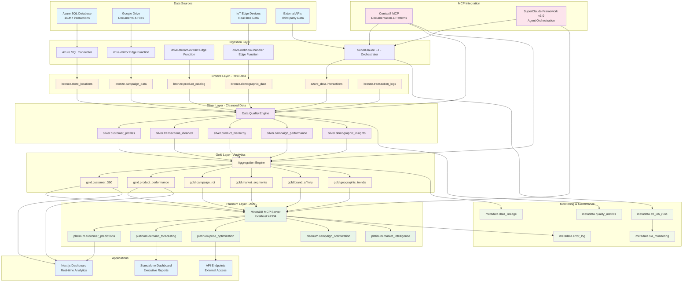
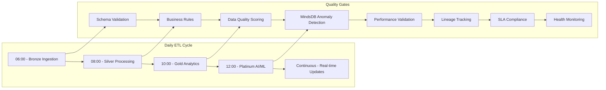
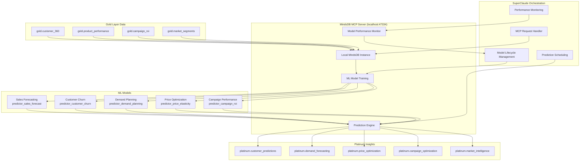
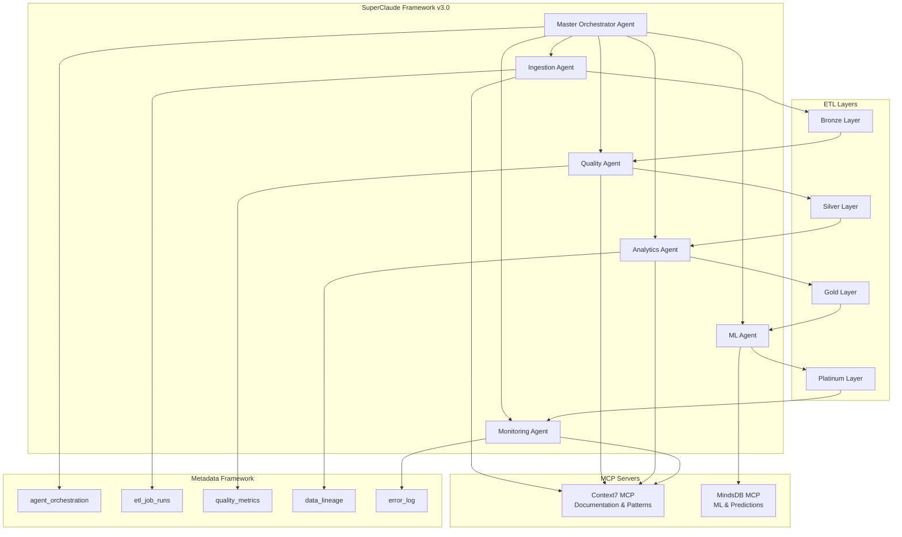
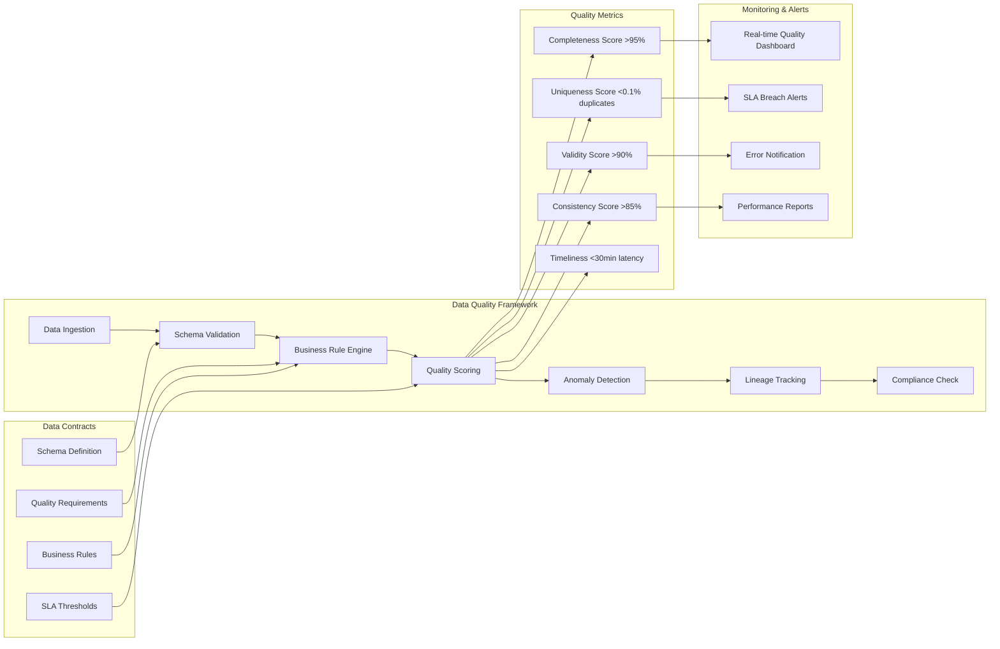
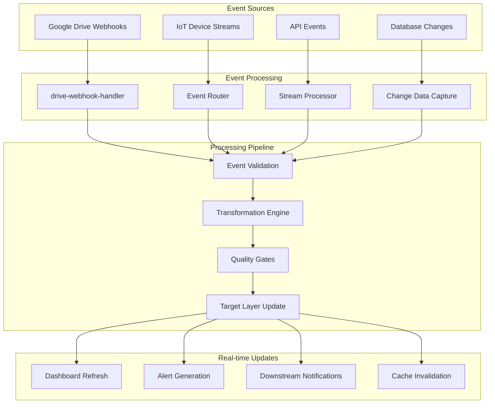
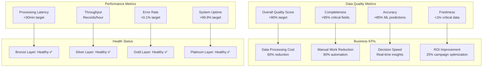

# Scout v7.1 Visual Data Flow Diagrams

## Complete System Architecture

## ETL Processing Pipeline

## MindsDB MCP Integration Flow

## SuperClaude Agent Orchestration

## Data Quality & Governance Flow

## Real-time Processing Architecture

## Performance & Monitoring Dashboard

