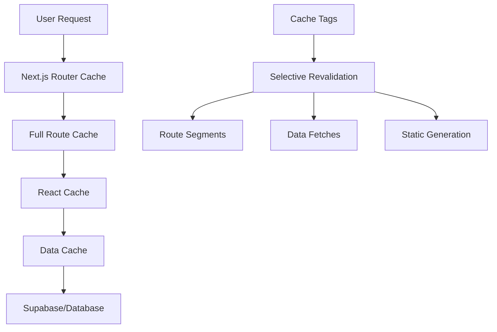

# Cache Tag Strategy Documentation

## Overview
Comprehensive caching strategy for Scout Dashboard v5.0 using Next.js App Router cache tags, Supabase integration, and performance optimization techniques.

## Cache Architecture

### 1. Next.js App Router Caching Layers



#### Router Cache (Client-side)
- **Duration**: 30 seconds (default)
- **Purpose**: Cache route segments in browser
- **Revalidation**: Time-based and on-demand

#### Full Route Cache (Server-side)
- **Duration**: Until revalidation
- **Purpose**: Cache rendered routes
- **Revalidation**: Via cache tags

#### Data Cache (Server-side)
- **Duration**: Persistent across requests
- **Purpose**: Cache fetch results
- **Revalidation**: Via revalidateTag()

### 2. Cache Tag Taxonomy

```typescript
// Cache tag naming convention
interface CacheTagSchema {
  // Entity-based tags
  user: `user:${userId}`;
  campaign: `campaign:${campaignId}`;
  analytics: `analytics:${dateRange}:${dimensions}`;
  dashboard: `dashboard:${dashboardId}:${userId}`;
  
  // Collection-based tags
  users: 'users:list';
  campaigns: 'campaigns:list';
  reports: 'reports:list';
  
  // Permission-based tags
  userPermissions: `permissions:${userId}`;
  rolePermissions: `role:${roleId}`;
  
  // Time-based tags
  daily: `daily:${date}`;
  weekly: `weekly:${weekStart}`;
  monthly: `monthly:${monthYear}`;
  
  // Feature-based tags
  search: `search:${query}:${filters}`;
  export: `export:${type}:${params}`;
}
```

## Implementation Strategy

### 1. Data Fetching with Cache Tags

```typescript
// lib/data/campaigns.ts
import { unstable_cache } from 'next/cache';
import { createClient } from '@/lib/supabase/server';

export async function getCampaigns(userId: string) {
  return unstable_cache(
    async () => {
      const supabase = createClient();
      const { data, error } = await supabase
        .from('campaigns')
        .select('*')
        .eq('user_id', userId);
      
      if (error) throw error;
      return data;
    },
    [`campaigns:${userId}`], // Cache key
    {
      tags: [
        'campaigns:list',
        `user:${userId}:campaigns`,
        'dashboard:data'
      ],
      revalidate: 300, // 5 minutes
    }
  );
}

export async function getCampaign(campaignId: string, userId: string) {
  return unstable_cache(
    async () => {
      const supabase = createClient();
      const { data, error } = await supabase
        .from('campaigns')
        .select('*')
        .eq('id', campaignId)
        .eq('user_id', userId)
        .single();
      
      if (error) throw error;
      return data;
    },
    [`campaign:${campaignId}:${userId}`],
    {
      tags: [
        `campaign:${campaignId}`,
        `user:${userId}:campaigns`,
        'campaigns:list'
      ],
      revalidate: 600, // 10 minutes
    }
  );
}
```

### 2. Route-Level Caching

```typescript
// app/dashboard/campaigns/page.tsx
export const revalidate = 300; // 5 minutes
export const tags = ['campaigns:list', 'dashboard:campaigns'];

export default async function CampaignsPage({
  searchParams
}: {
  searchParams: { [key: string]: string | undefined };
}) {
  const { userId } = await auth();
  
  // Cached data fetch
  const campaigns = await getCampaigns(userId);
  
  // Generate dynamic cache tags based on search params
  const searchTags = generateSearchTags(searchParams);
  
  return (
    <div>
      <CampaignsList campaigns={campaigns} />
    </div>
  );
}

function generateSearchTags(searchParams: Record<string, string | undefined>) {
  const tags = ['campaigns:search'];
  
  if (searchParams.q) {
    tags.push(`search:${searchParams.q}`);
  }
  
  if (searchParams.status) {
    tags.push(`filter:status:${searchParams.status}`);
  }
  
  if (searchParams.dateRange) {
    tags.push(`filter:dateRange:${searchParams.dateRange}`);
  }
  
  return tags;
}
```

### 3. API Route Caching

```typescript
// app/api/campaigns/route.ts
import { NextRequest, NextResponse } from 'next/server';
import { revalidateTag } from 'next/cache';
import { getCampaigns } from '@/lib/data/campaigns';

export async function GET(request: NextRequest) {
  try {
    const { searchParams } = new URL(request.url);
    const userId = searchParams.get('userId');
    
    if (!userId) {
      return NextResponse.json({ error: 'User ID required' }, { status: 400 });
    }
    
    const campaigns = await getCampaigns(userId);
    
    return NextResponse.json(
      { campaigns },
      {
        headers: {
          'Cache-Control': 'public, max-age=300, stale-while-revalidate=600',
          'Cache-Tags': `campaigns:list,user:${userId}:campaigns,dashboard:data`,
        }
      }
    );
  } catch (error) {
    return NextResponse.json(
      { error: 'Failed to fetch campaigns' },
      { status: 500 }
    );
  }
}

export async function POST(request: NextRequest) {
  try {
    const body = await request.json();
    // ... create campaign logic
    
    // Invalidate relevant cache tags
    revalidateTag('campaigns:list');
    revalidateTag(`user:${body.userId}:campaigns`);
    revalidateTag('dashboard:data');
    
    return NextResponse.json({ success: true });
  } catch (error) {
    return NextResponse.json(
      { error: 'Failed to create campaign' },
      { status: 500 }
    );
  }
}
```

### 4. Component-Level Caching

```typescript
// components/dashboard/CampaignMetrics.tsx
import { unstable_cache } from 'next/cache';
import { getCampaignMetrics } from '@/lib/data/analytics';

interface CampaignMetricsProps {
  campaignId: string;
  dateRange: string;
}

export async function CampaignMetrics({ campaignId, dateRange }: CampaignMetricsProps) {
  const getCachedMetrics = unstable_cache(
    async (id: string, range: string) => {
      return getCampaignMetrics(id, range);
    },
    [`metrics:${campaignId}:${dateRange}`],
    {
      tags: [
        `campaign:${campaignId}:metrics`,
        `analytics:${dateRange}`,
        'dashboard:metrics'
      ],
      revalidate: 900, // 15 minutes
    }
  );
  
  const metrics = await getCachedMetrics(campaignId, dateRange);
  
  return (
    <div className="grid grid-cols-4 gap-4">
      <MetricCard title="Impressions" value={metrics.impressions} />
      <MetricCard title="Clicks" value={metrics.clicks} />
      <MetricCard title="CTR" value={metrics.ctr} />
      <MetricCard title="Conversions" value={metrics.conversions} />
    </div>
  );
}
```

## Cache Revalidation Strategies

### 1. Event-Driven Revalidation

```typescript
// lib/cache/revalidation.ts
import { revalidateTag, revalidatePath } from 'next/cache';

export class CacheRevalidator {
  // Campaign-related revalidation
  static async revalidateCampaign(campaignId: string, userId: string) {
    const tags = [
      `campaign:${campaignId}`,
      `user:${userId}:campaigns`,
      'campaigns:list',
      'dashboard:data',
      'dashboard:campaigns'
    ];
    
    await Promise.all(tags.map(tag => revalidateTag(tag)));
    
    // Also revalidate specific paths
    revalidatePath('/dashboard/campaigns');
    revalidatePath(`/dashboard/campaigns/${campaignId}`);
  }
  
  // Analytics revalidation
  static async revalidateAnalytics(dateRange: string, dimensions: string[] = []) {
    const tags = [
      `analytics:${dateRange}`,
      'dashboard:metrics',
      'dashboard:analytics'
    ];
    
    // Add dimension-specific tags
    dimensions.forEach(dim => {
      tags.push(`analytics:${dateRange}:${dim}`);
    });
    
    await Promise.all(tags.map(tag => revalidateTag(tag)));
    revalidatePath('/dashboard/analytics');
  }
  
  // User-specific revalidation
  static async revalidateUser(userId: string) {
    const tags = [
      `user:${userId}`,
      `user:${userId}:campaigns`,
      `user:${userId}:permissions`,
      'dashboard:data'
    ];
    
    await Promise.all(tags.map(tag => revalidateTag(tag)));
    revalidatePath('/dashboard');
  }
  
  // Bulk revalidation for major updates
  static async revalidateAll() {
    const tags = [
      'campaigns:list',
      'users:list',
      'analytics:*',
      'dashboard:*'
    ];
    
    await Promise.all(tags.map(tag => revalidateTag(tag)));
    revalidatePath('/dashboard');
  }
}
```

### 2. Webhook-Triggered Revalidation

```typescript
// app/api/revalidate/route.ts
import { NextRequest, NextResponse } from 'next/server';
import { CacheRevalidator } from '@/lib/cache/revalidation';

export async function POST(request: NextRequest) {
  try {
    const body = await request.json();
    const { type, data, secret } = body;
    
    // Verify webhook secret
    if (secret !== process.env.REVALIDATION_SECRET) {
      return NextResponse.json({ error: 'Unauthorized' }, { status: 401 });
    }
    
    switch (type) {
      case 'campaign.updated':
        await CacheRevalidator.revalidateCampaign(data.campaignId, data.userId);
        break;
        
      case 'analytics.updated':
        await CacheRevalidator.revalidateAnalytics(data.dateRange, data.dimensions);
        break;
        
      case 'user.updated':
        await CacheRevalidator.revalidateUser(data.userId);
        break;
        
      case 'data.bulk_update':
        await CacheRevalidator.revalidateAll();
        break;
        
      default:
        return NextResponse.json({ error: 'Unknown event type' }, { status: 400 });
    }
    
    return NextResponse.json({ success: true, revalidated: true });
  } catch (error) {
    console.error('Revalidation error:', error);
    return NextResponse.json(
      { error: 'Revalidation failed' },
      { status: 500 }
    );
  }
}
```

### 3. Time-Based Revalidation

```typescript
// lib/cache/scheduler.ts
export class CacheScheduler {
  // Schedule regular cache updates
  static scheduleRevalidation() {
    // Daily analytics refresh
    setInterval(async () => {
      const yesterday = new Date();
      yesterday.setDate(yesterday.getDate() - 1);
      const dateRange = yesterday.toISOString().split('T')[0];
      
      await CacheRevalidator.revalidateAnalytics(dateRange);
    }, 24 * 60 * 60 * 1000); // Daily
    
    // Weekly campaign performance refresh
    setInterval(async () => {
      revalidateTag('campaigns:performance');
      revalidateTag('dashboard:weekly');
    }, 7 * 24 * 60 * 60 * 1000); // Weekly
  }
  
  // Smart revalidation based on data freshness
  static async smartRevalidate(tag: string, lastUpdated: Date) {
    const now = new Date();
    const hoursSinceUpdate = (now.getTime() - lastUpdated.getTime()) / (1000 * 60 * 60);
    
    // Revalidate if data is older than threshold
    const thresholds = {
      'analytics:': 1, // 1 hour
      'campaigns:': 6, // 6 hours
      'dashboard:': 12, // 12 hours
    };
    
    const threshold = Object.entries(thresholds).find(([prefix]) => 
      tag.startsWith(prefix)
    )?.[1] || 24;
    
    if (hoursSinceUpdate > threshold) {
      await revalidateTag(tag);
    }
  }
}
```

## Cache Performance Optimization

### 1. Cache Warming

```typescript
// lib/cache/warming.ts
export class CacheWarmer {
  // Pre-warm critical data
  static async warmCriticalCache(userId: string) {
    const warmingTasks = [
      // Warm user data
      getCampaigns(userId),
      getUserPermissions(userId),
      
      // Warm dashboard data
      getDashboardMetrics(userId, '30d'),
      getRecentActivity(userId),
      
      // Warm common analytics
      getAnalytics('7d', ['campaign', 'channel']),
    ];
    
    await Promise.allSettled(warmingTasks);
  }
  
  // Warm cache based on usage patterns
  static async warmByPattern(pattern: string) {
    switch (pattern) {
      case 'morning_dashboard':
        // Pre-load data typically accessed in morning
        await Promise.all([
          revalidateTag('analytics:yesterday'),
          revalidateTag('dashboard:overview'),
          revalidateTag('campaigns:active'),
        ]);
        break;
        
      case 'week_start':
        // Pre-load weekly reports
        await Promise.all([
          revalidateTag('analytics:weekly'),
          revalidateTag('reports:weekly'),
        ]);
        break;
    }
  }
}
```

### 2. Cache Monitoring

```typescript
// lib/cache/monitoring.ts
export class CacheMonitor {
  private static metrics: Map<string, CacheMetrics> = new Map();
  
  interface CacheMetrics {
    hits: number;
    misses: number;
    lastAccess: Date;
    averageLoadTime: number;
  }
  
  static recordCacheHit(tag: string) {
    const metrics = this.metrics.get(tag) || {
      hits: 0,
      misses: 0,
      lastAccess: new Date(),
      averageLoadTime: 0,
    };
    
    metrics.hits++;
    metrics.lastAccess = new Date();
    this.metrics.set(tag, metrics);
  }
  
  static recordCacheMiss(tag: string, loadTime: number) {
    const metrics = this.metrics.get(tag) || {
      hits: 0,
      misses: 0,
      lastAccess: new Date(),
      averageLoadTime: 0,
    };
    
    metrics.misses++;
    metrics.lastAccess = new Date();
    metrics.averageLoadTime = (metrics.averageLoadTime + loadTime) / 2;
    this.metrics.set(tag, metrics);
  }
  
  static getCacheEfficiency(tag: string): number {
    const metrics = this.metrics.get(tag);
    if (!metrics) return 0;
    
    const total = metrics.hits + metrics.misses;
    return total > 0 ? metrics.hits / total : 0;
  }
  
  static generateReport(): CacheReport {
    const report: CacheReport = {
      totalTags: this.metrics.size,
      averageEfficiency: 0,
      topPerforming: [],
      needsOptimization: [],
    };
    
    const efficiencies: { tag: string; efficiency: number }[] = [];
    
    this.metrics.forEach((metrics, tag) => {
      const efficiency = this.getCacheEfficiency(tag);
      efficiencies.push({ tag, efficiency });
    });
    
    efficiencies.sort((a, b) => b.efficiency - a.efficiency);
    
    report.averageEfficiency = efficiencies.reduce((sum, item) => 
      sum + item.efficiency, 0
    ) / efficiencies.length;
    
    report.topPerforming = efficiencies.slice(0, 10);
    report.needsOptimization = efficiencies.filter(item => 
      item.efficiency < 0.5
    );
    
    return report;
  }
}
```

## Cache Configuration

### 1. Environment-Based Configuration

```typescript
// lib/cache/config.ts
export const cacheConfig = {
  development: {
    defaultRevalidate: 60, // 1 minute
    maxAge: 300, // 5 minutes
    staleWhileRevalidate: 600, // 10 minutes
    enableDebug: true,
  },
  
  staging: {
    defaultRevalidate: 300, // 5 minutes
    maxAge: 600, // 10 minutes
    staleWhileRevalidate: 1800, // 30 minutes
    enableDebug: true,
  },
  
  production: {
    defaultRevalidate: 600, // 10 minutes
    maxAge: 1800, // 30 minutes
    staleWhileRevalidate: 3600, // 1 hour
    enableDebug: false,
  },
};

export function getCacheConfig() {
  const env = process.env.NODE_ENV || 'development';
  return cacheConfig[env as keyof typeof cacheConfig];
}
```

### 2. Cache Headers Strategy

```typescript
// lib/cache/headers.ts
export function generateCacheHeaders(
  maxAge: number,
  staleWhileRevalidate: number = maxAge * 2,
  tags: string[] = []
): HeadersInit {
  return {
    'Cache-Control': [
      'public',
      `max-age=${maxAge}`,
      `stale-while-revalidate=${staleWhileRevalidate}`,
      's-maxage=' + maxAge,
    ].join(', '),
    'Cache-Tags': tags.join(','),
    'Vary': 'Authorization, Accept-Encoding',
  };
}

// Usage in API routes
export async function GET(request: NextRequest) {
  const data = await fetchData();
  
  return NextResponse.json(data, {
    headers: generateCacheHeaders(
      600, // 10 minutes
      1800, // 30 minutes stale-while-revalidate
      ['campaigns:list', 'dashboard:data']
    )
  });
}
```

## Testing Cache Strategy

### 1. Cache Testing Utilities

```typescript
// lib/cache/testing.ts
export class CacheTestHelper {
  static async verifyCacheHit(tag: string): Promise<boolean> {
    // Implementation would depend on cache backend
    // For Next.js, we can check if data is served from cache
    const startTime = performance.now();
    
    // Fetch data twice
    await fetchDataWithTag(tag);
    const secondFetchTime = performance.now();
    await fetchDataWithTag(tag);
    const totalTime = performance.now() - secondFetchTime;
    
    // If second fetch is significantly faster, it's likely cached
    return totalTime < secondFetchTime * 0.5;
  }
  
  static async testRevalidation(tag: string) {
    // Fetch initial data
    const initialData = await fetchDataWithTag(tag);
    
    // Trigger revalidation
    await revalidateTag(tag);
    
    // Fetch again and compare
    const revalidatedData = await fetchDataWithTag(tag);
    
    return {
      revalidated: true,
      dataChanged: JSON.stringify(initialData) !== JSON.stringify(revalidatedData),
    };
  }
}
```

### 2. Performance Testing

```typescript
// tests/cache.performance.spec.ts
import { test, expect } from '@playwright/test';

test.describe('Cache Performance', () => {
  test('should serve cached dashboard data quickly', async ({ page }) => {
    // First visit - populate cache
    await page.goto('/dashboard');
    await page.waitForLoadState('networkidle');
    
    // Second visit - should be faster
    const startTime = Date.now();
    await page.goto('/dashboard');
    await page.waitForLoadState('networkidle');
    const loadTime = Date.now() - startTime;
    
    expect(loadTime).toBeLessThan(1000); // Should load in under 1 second
  });
  
  test('should revalidate cache on data update', async ({ page, request }) => {
    // Load page with data
    await page.goto('/dashboard/campaigns');
    const initialContent = await page.textContent('[data-testid="campaign-count"]');
    
    // Update data via API
    await request.post('/api/campaigns', {
      data: { name: 'Test Campaign' }
    });
    
    // Reload page - should show updated data
    await page.reload();
    const updatedContent = await page.textContent('[data-testid="campaign-count"]');
    
    expect(updatedContent).not.toBe(initialContent);
  });
});
```

## Best Practices & Guidelines

### 1. Cache Tag Naming

- Use consistent prefixes (entity, collection, feature)
- Include relevant identifiers (userId, campaignId)
- Use hierarchical structure (campaign:123:metrics)
- Keep tags under 250 characters

### 2. Revalidation Strategy

- Use specific tags for targeted revalidation
- Batch revalidation operations when possible
- Implement fallback strategies for failed revalidation
- Monitor revalidation frequency and effectiveness

### 3. Performance Optimization

- Set appropriate cache durations based on data volatility
- Use stale-while-revalidate for better user experience
- Implement cache warming for critical paths
- Monitor cache hit rates and optimize accordingly

### 4. Error Handling

```typescript
// Graceful cache error handling
export async function getCachedData(key: string, fetcher: () => Promise<any>) {
  try {
    return await unstable_cache(fetcher, [key], {
      tags: [key],
      revalidate: 300,
    })();
  } catch (error) {
    console.error(`Cache error for key ${key}:`, error);
    
    // Fallback to direct fetch
    return await fetcher();
  }
}
```

## Monitoring & Maintenance

### 1. Cache Metrics Dashboard

Track key metrics:
- Cache hit ratio by tag
- Average response times
- Revalidation frequency
- Cache storage usage
- Error rates

### 2. Regular Maintenance

- Weekly cache efficiency review
- Monthly tag optimization
- Quarterly strategy review
- Performance regression testing

### 3. Troubleshooting

Common issues and solutions:
- **Low hit rates**: Review tag specificity and revalidation frequency
- **Stale data**: Check revalidation triggers and webhook reliability
- **High memory usage**: Implement cache size limits and cleanup strategies
- **Slow revalidation**: Optimize data fetching and batch operations