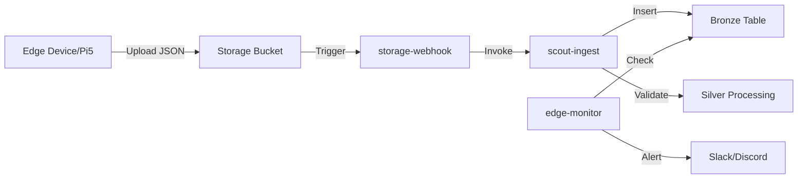

# Scout Edge Functions Guide

## 🚀 Overview

This guide explains how to leverage Supabase Edge Functions with Claude Desktop MCP for automated edge device data processing.

## Architecture



## Edge Functions

### 1. `scout-ingest`
Main data processing function with three actions:
- **process-storage-upload**: Process files from storage
- **validate-and-ingest**: Validate and insert data with quality scoring
- **batch-process**: Process multiple files at once

### 2. `storage-webhook`
Automatically triggered when files land in storage:
- Monitors `scout-bronze` bucket
- Processes files in `scout/v1/bronze/` path
- Moves processed files to `processed/` folder

### 3. `edge-monitor`
Health monitoring and alerting:
- Checks error rates
- Monitors processing backlog
- Tracks average processing times
- Sends alerts via webhook

## Setup Instructions

### 1. Deploy Edge Functions

```bash
# Load your environment
source scripts/secrets.sh

# Deploy all functions
./scripts/deploy-edge-functions.sh
```

### 2. Configure Storage Trigger

Option A: Database Webhook (Recommended)
1. Go to Supabase Dashboard → Database → Webhooks
2. Create webhook for `storage.objects` INSERT events
3. Point to `https://[project].functions.supabase.co/storage-webhook`

Option B: SQL Trigger
```sql
-- Run in SQL Editor
-- Copy from scripts/setup-storage-triggers.sql
```

### 3. Configure MCP for Claude Desktop

Add to your Claude Desktop config:
```json
{
  "mcpServers": {
    "scout_edge_functions": {
      "command": "npx",
      "args": [
        "-y",
        "@supabase/mcp-server-supabase@latest",
        "--project-ref=cxzllzyxwpyptfretryc"
      ],
      "env": {
        "SUPABASE_ACCESS_TOKEN": "your-token",
        "SUPABASE_SERVICE_ROLE_KEY": "your-key"
      }
    }
  }
}
```

## Usage Examples

### Manual File Processing
```bash
curl -X POST https://[project].functions.supabase.co/scout-ingest \
  -H "Authorization: Bearer $SUPABASE_ANON_KEY" \
  -H "Content-Type: application/json" \
  -d '{
    "action": "process-storage-upload",
    "payload": {
      "bucket": "scout-bronze",
      "path": "scout/v1/bronze/device-001/data.json"
    }
  }'
```

### Batch Processing
```bash
curl -X POST https://[project].functions.supabase.co/scout-ingest \
  -H "Authorization: Bearer $SUPABASE_ANON_KEY" \
  -H "Content-Type: application/json" \
  -d '{
    "action": "batch-process",
    "payload": {
      "source_bucket": "scout-bronze",
      "start_date": "2024-01-01",
      "end_date": "2024-01-31"
    }
  }'
```

### Check Health Status
```bash
curl https://[project].functions.supabase.co/edge-monitor \
  -H "Authorization: Bearer $SUPABASE_ANON_KEY"
```

## Monitoring

### View Processing Logs
```sql
-- Recent processing activity
SELECT * FROM edge_processing_logs 
ORDER BY created_at DESC 
LIMIT 50;

-- Processing statistics
SELECT * FROM edge_processing_stats;

-- Health check
SELECT * FROM check_edge_processing_health();
```

### Set Up Alerts
Configure `ALERT_WEBHOOK_URL` environment variable for Slack/Discord notifications:
```bash
supabase secrets set ALERT_WEBHOOK_URL=https://hooks.slack.com/services/...
```

## Data Flow

1. **Edge Device** uploads JSON to `scout-bronze/scout/v1/bronze/[device-id]/[timestamp].json`
2. **Storage Webhook** automatically triggers on upload
3. **scout-ingest** function:
   - Downloads file from storage
   - Validates data structure
   - Calculates quality score
   - Inserts into `bronze_edge_raw` table
   - Moves file to `processed/` folder
4. **Silver Processing** triggered if quality score > 0.8
5. **edge-monitor** runs every 15 minutes to check health

## Security

- Edge Functions use Service Role Key (keep secure)
- Storage uploads use limited `storage_uploader` role
- All functions validate input and handle errors
- Processing logs track all operations

## Troubleshooting

### Function not triggering
```bash
# Check function logs
supabase functions logs scout-ingest --project-ref [ref]

# Check webhook configuration
SELECT * FROM supabase_functions.hooks;
```

### Processing errors
```sql
-- Find recent errors
SELECT * FROM edge_processing_logs 
WHERE status = 'error' 
ORDER BY created_at DESC;
```

### Performance issues
```sql
-- Check processing times
SELECT 
  DATE(created_at) as date,
  AVG(processing_time_ms) as avg_ms,
  MAX(processing_time_ms) as max_ms
FROM edge_processing_logs
WHERE status = 'success'
GROUP BY DATE(created_at)
ORDER BY date DESC;
```

## Best Practices

1. **Batch Size**: Process files in batches of 100-1000 for optimal performance
2. **Error Handling**: All functions log errors to `edge_processing_logs`
3. **Monitoring**: Set up alerts for critical metrics
4. **Data Quality**: Aim for > 0.8 quality score for silver processing
5. **File Naming**: Use consistent naming: `[device-id]/[timestamp].json`

## Next Steps

1. Deploy functions using the provided script
2. Configure storage webhook
3. Test with sample data upload
4. Monitor processing health
5. Set up production alerts