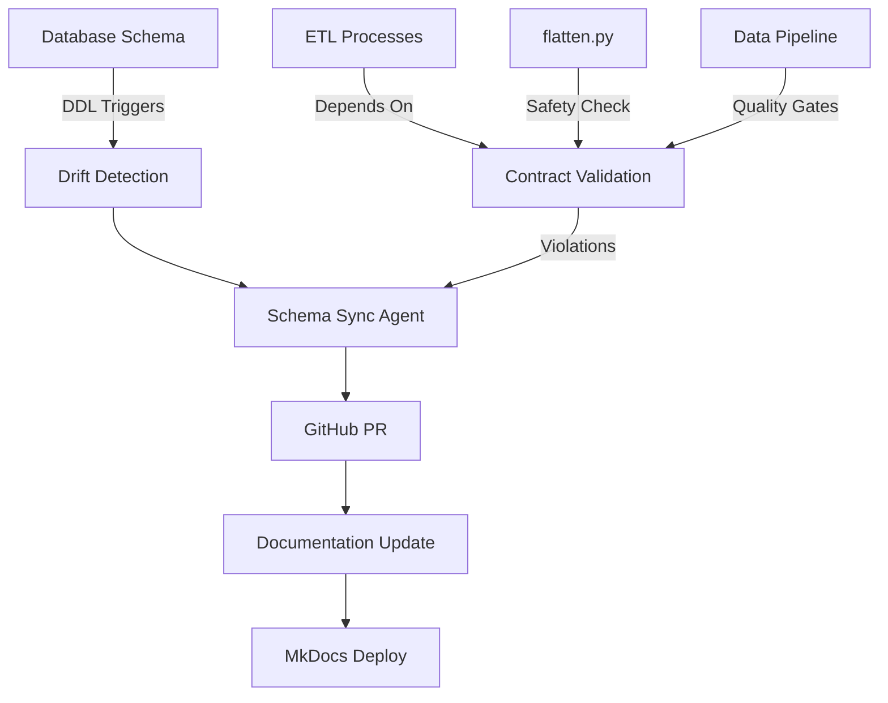

# Scout v7 Database Documentation

Welcome to the Scout v7 database documentation. This documentation is automatically generated from the database schema and kept synchronized with any changes.

## 🔄 Auto-Sync System

This documentation platform features:

- **Automatic Updates**: Schema changes trigger documentation updates
- **ETL Contract Validation**: Ensures data pipeline integrity
- **Drift Detection**: Monitors and tracks all database changes
- **GitHub Integration**: Changes create PRs for review

## 📚 Documentation Sections

### [Database Schema](schemas/database.md)
Complete database schema documentation including tables, views, and procedures with column definitions and relationships.

### [ETL Contracts](etl/contracts.md)
Validation status of critical data contracts that ETL processes depend on, ensuring pipeline reliability.

## 🛡️ Data Quality Assurance

The Scout v7 platform maintains data quality through:

1. **Schema Drift Detection** - DDL triggers capture all changes
2. **Contract Validation** - Critical ETL dependencies are monitored
3. **Automated Testing** - Schema changes trigger validation workflows
4. **Documentation Sync** - Changes automatically update documentation

## 🚀 Getting Started

To work with the Scout v7 database:

1. Review the [database schema](schemas/database.md) for table structures
2. Check [ETL contracts](etl/contracts.md) for data dependencies
3. Follow the deployment process for schema changes
4. Monitor drift detection for automatic sync

## 🏗️ Architecture Overview

## 📊 System Health

The auto-sync system continuously monitors:

- **Schema Changes**: All DDL operations are captured and tracked
- **ETL Contracts**: Critical data dependencies are validated
- **Documentation Drift**: Repo vs. database consistency
- **Pipeline Safety**: Breaking changes are detected before deployment

---

*Last updated: 2025-01-25 00:00:00 UTC*
*Generated by: Schema Sync Agent*