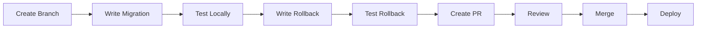

# Database Migrations Governance

## Overview
This document establishes the governance framework for managing database migrations in the TBWA Scout Dashboard v5.0 project using Supabase.

## Migration Principles

### 1. Version Control
- All migrations MUST be committed to version control
- Migration files are immutable once merged to main
- Use semantic versioning for migration naming

### 2. Naming Convention
```
YYYYMMDDHHMMSS_<type>_<description>.sql

Types:
- create: New tables/schemas
- alter: Modify existing structures
- drop: Remove structures
- seed: Add reference data
- fix: Correct issues
```

### 3. Migration Structure

#### Standard Migration Template
```sql
-- Migration: YYYYMMDDHHMMSS_type_description.sql
-- Author: <github_username>
-- Ticket: <JIRA/Issue number>
-- Description: <Detailed description of changes>

-- ============================================
-- Pre-checks
-- ============================================
DO $$
BEGIN
  -- Check if migration has already been applied
  IF EXISTS (
    SELECT 1 FROM migrations_history 
    WHERE migration_name = 'YYYYMMDDHHMMSS_type_description'
  ) THEN
    RAISE NOTICE 'Migration already applied, skipping...';
    RETURN;
  END IF;
END $$;

-- ============================================
-- Migration Up
-- ============================================
BEGIN;

-- Your migration code here

-- Record migration
INSERT INTO migrations_history (migration_name, applied_at, applied_by)
VALUES ('YYYYMMDDHHMMSS_type_description', NOW(), current_user);

COMMIT;

-- ============================================
-- Rollback Script (stored separately)
-- ============================================
-- See: YYYYMMDDHHMMSS_type_description.down.sql
```

#### Rollback Template
```sql
-- Rollback: YYYYMMDDHHMMSS_type_description.down.sql
-- CAUTION: Review data loss implications before running

BEGIN;

-- Your rollback code here

-- Remove migration record
DELETE FROM migrations_history 
WHERE migration_name = 'YYYYMMDDHHMMSS_type_description';

COMMIT;
```

## Migration Workflow

### 1. Development Process


### 2. Review Checklist

#### Code Review Requirements
- [ ] Migration follows naming convention
- [ ] Includes descriptive comments
- [ ] Has corresponding rollback script
- [ ] Uses transactions appropriately
- [ ] Handles existing data correctly
- [ ] Includes necessary indexes
- [ ] Updates RLS policies if needed
- [ ] Performance impact assessed

#### Testing Requirements
- [ ] Tested on local database
- [ ] Tested with production-like data volume
- [ ] Rollback tested and verified
- [ ] No breaking changes for existing code
- [ ] API compatibility maintained

### 3. Deployment Process

#### Staging Deployment
```bash
# 1. Create backup
supabase db dump -f staging-backup-$(date +%Y%m%d%H%M%S).sql

# 2. Apply migrations
supabase migration up --db-url $STAGING_DATABASE_URL

# 3. Run validation
npm run validate:db:staging

# 4. Monitor for 24 hours
```

#### Production Deployment
```bash
# 1. Announce maintenance window
./scripts/announce-maintenance.sh

# 2. Create backup
supabase db dump -f prod-backup-$(date +%Y%m%d%H%M%S).sql

# 3. Apply migrations
supabase migration up --db-url $PRODUCTION_DATABASE_URL

# 4. Validate
npm run validate:db:production

# 5. Monitor and verify
./scripts/verify-migration.sh
```

## Migration Categories

### 1. Schema Migrations
```sql
-- Example: Create new table
CREATE TABLE IF NOT EXISTS scout_dash.metrics (
  id UUID PRIMARY KEY DEFAULT gen_random_uuid(),
  metric_name TEXT NOT NULL,
  metric_value NUMERIC NOT NULL,
  recorded_at TIMESTAMPTZ DEFAULT NOW(),
  metadata JSONB,
  created_at TIMESTAMPTZ DEFAULT NOW(),
  updated_at TIMESTAMPTZ DEFAULT NOW()
);

-- Add indexes
CREATE INDEX idx_metrics_recorded_at ON scout_dash.metrics(recorded_at);
CREATE INDEX idx_metrics_name ON scout_dash.metrics(metric_name);

-- Add RLS
ALTER TABLE scout_dash.metrics ENABLE ROW LEVEL SECURITY;

CREATE POLICY "metrics_read_policy" ON scout_dash.metrics
  FOR SELECT USING (auth.role() IN ('authenticated', 'service_role'));
```

### 2. Data Migrations
```sql
-- Example: Migrate data between tables
INSERT INTO scout_dash.metrics (metric_name, metric_value, recorded_at)
SELECT 
  'campaign_' || campaign_type,
  COUNT(*),
  NOW()
FROM scout_dash.campaigns
GROUP BY campaign_type;
```

### 3. Performance Migrations
```sql
-- Example: Add missing indexes
CREATE INDEX CONCURRENTLY idx_campaigns_date_range 
ON scout_dash.campaigns(start_date, end_date);

-- Analyze tables
ANALYZE scout_dash.campaigns;
```

## Migration Tools

### 1. Migration History Table
```sql
CREATE TABLE IF NOT EXISTS public.migrations_history (
  id SERIAL PRIMARY KEY,
  migration_name TEXT UNIQUE NOT NULL,
  applied_at TIMESTAMPTZ NOT NULL,
  applied_by TEXT NOT NULL,
  execution_time INTERVAL,
  checksum TEXT,
  rollback_applied BOOLEAN DEFAULT FALSE,
  rollback_at TIMESTAMPTZ,
  metadata JSONB
);
```

### 2. Migration Validation Script
```typescript
// scripts/validate-migration.ts
import { createClient } from '@supabase/supabase-js';
import crypto from 'crypto';
import fs from 'fs';

async function validateMigration(migrationPath: string) {
  const content = fs.readFileSync(migrationPath, 'utf8');
  
  // Check naming convention
  const filename = path.basename(migrationPath);
  const pattern = /^\d{14}_[a-z]+_[a-z0-9_]+\.sql$/;
  if (!pattern.test(filename)) {
    throw new Error('Invalid migration filename');
  }
  
  // Check for required comments
  if (!content.includes('-- Author:')) {
    throw new Error('Missing author comment');
  }
  
  if (!content.includes('-- Description:')) {
    throw new Error('Missing description comment');
  }
  
  // Check for transaction usage
  if (!content.includes('BEGIN;') || !content.includes('COMMIT;')) {
    console.warn('Migration does not use transactions');
  }
  
  // Calculate checksum
  const checksum = crypto
    .createHash('sha256')
    .update(content)
    .digest('hex');
    
  return { valid: true, checksum };
}
```

### 3. Migration Generator
```bash
#!/bin/bash
# scripts/generate-migration.sh

TYPE=$1
DESCRIPTION=$2

if [ -z "$TYPE" ] || [ -z "$DESCRIPTION" ]; then
  echo "Usage: ./generate-migration.sh <type> <description>"
  echo "Types: create, alter, drop, seed, fix"
  exit 1
fi

TIMESTAMP=$(date +%Y%m%d%H%M%S)
FILENAME="${TIMESTAMP}_${TYPE}_${DESCRIPTION}.sql"
ROLLBACK_FILENAME="${TIMESTAMP}_${TYPE}_${DESCRIPTION}.down.sql"

# Create migration file
cat > "supabase/migrations/${FILENAME}" << EOF
-- Migration: ${FILENAME}
-- Author: $(git config user.name)
-- Ticket: 
-- Description: ${DESCRIPTION}

-- ============================================
-- Pre-checks
-- ============================================
DO \$\$
BEGIN
  IF EXISTS (
    SELECT 1 FROM migrations_history 
    WHERE migration_name = '${TIMESTAMP}_${TYPE}_${DESCRIPTION}'
  ) THEN
    RAISE NOTICE 'Migration already applied, skipping...';
    RETURN;
  END IF;
END \$\$;

-- ============================================
-- Migration Up
-- ============================================
BEGIN;

-- TODO: Add your migration code here

-- Record migration
INSERT INTO migrations_history (migration_name, applied_at, applied_by)
VALUES ('${TIMESTAMP}_${TYPE}_${DESCRIPTION}', NOW(), current_user);

COMMIT;
EOF

# Create rollback file
cat > "supabase/migrations/${ROLLBACK_FILENAME}" << EOF
-- Rollback: ${ROLLBACK_FILENAME}
-- CAUTION: Review data loss implications before running

BEGIN;

-- TODO: Add your rollback code here

-- Remove migration record
DELETE FROM migrations_history 
WHERE migration_name = '${TIMESTAMP}_${TYPE}_${DESCRIPTION}';

COMMIT;
EOF

echo "Created migration: ${FILENAME}"
echo "Created rollback: ${ROLLBACK_FILENAME}"
```

## Best Practices

### 1. DO's
- ✅ Always use transactions
- ✅ Test migrations on a copy of production data
- ✅ Include rollback scripts
- ✅ Add indexes for foreign keys
- ✅ Update RLS policies when adding tables
- ✅ Document breaking changes
- ✅ Use `IF EXISTS` / `IF NOT EXISTS`
- ✅ Consider data volume impact

### 2. DON'Ts
- ❌ Never modify existing migrations
- ❌ Don't drop columns without data backup
- ❌ Avoid locking tables in production
- ❌ Don't use `SELECT *` in migrations
- ❌ Never hardcode environment-specific values
- ❌ Don't ignore rollback scripts
- ❌ Avoid mixing DDL and DML in same transaction

### 3. Performance Considerations
```sql
-- Use CONCURRENTLY for index creation
CREATE INDEX CONCURRENTLY idx_name ON table(column);

-- Batch large updates
UPDATE large_table 
SET column = value 
WHERE id IN (
  SELECT id FROM large_table 
  WHERE condition 
  LIMIT 1000
);

-- Use VACUUM after large deletes
VACUUM ANALYZE table_name;
```

## Emergency Procedures

### 1. Failed Migration Recovery
```bash
# 1. Identify failed migration
psql $DATABASE_URL -c "
  SELECT * FROM migrations_history 
  WHERE applied_at > NOW() - INTERVAL '1 hour'
  ORDER BY applied_at DESC;
"

# 2. Run rollback
psql $DATABASE_URL -f migrations/YYYYMMDDHHMMSS_type_description.down.sql

# 3. Investigate and fix
# 4. Re-apply after fix
```

### 2. Data Corruption Recovery
```bash
# 1. Stop application
./scripts/maintenance-mode.sh enable

# 2. Restore from backup
pg_restore -d $DATABASE_URL backup-file.sql

# 3. Re-apply migrations since backup
./scripts/replay-migrations.sh --since="2023-01-01"

# 4. Verify data integrity
./scripts/verify-data-integrity.sh

# 5. Resume application
./scripts/maintenance-mode.sh disable
```

## Monitoring

### 1. Migration Metrics
```sql
-- Monitor migration execution times
SELECT 
  migration_name,
  execution_time,
  applied_at,
  applied_by
FROM migrations_history
WHERE execution_time > INTERVAL '5 seconds'
ORDER BY execution_time DESC;

-- Check for failed migrations
SELECT COUNT(*) as pending_migrations
FROM (
  SELECT generate_series(1, 100) as expected_sequence
) expected
LEFT JOIN migrations_history mh ON expected.expected_sequence = mh.id
WHERE mh.id IS NULL;
```

### 2. Alerts
- Migration execution time > 30 seconds
- Rollback executed in production
- Migration failure detected
- Schema drift between environments

## Compliance

### 1. Audit Requirements
- All migrations must be traceable to tickets
- Production migrations require approval
- Rollbacks must be documented
- Data deletions require retention policy review

### 2. Security Review
- Migrations modifying auth tables require security review
- New RLS policies require security team approval
- Encryption changes require compliance review

## Resources

- [Supabase Migrations Guide](https://supabase.com/docs/guides/migrations)
- [PostgreSQL Best Practices](https://wiki.postgresql.org/wiki/Best_Practices)
- [Database Refactoring](https://databaserefactoring.com/)