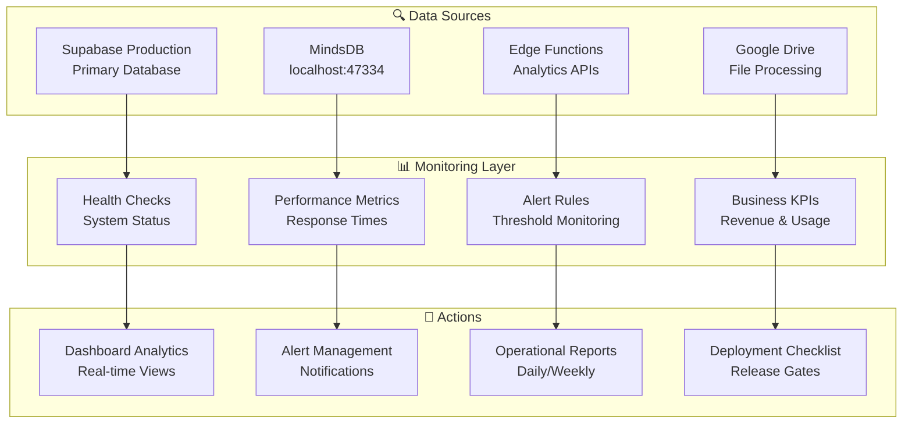

# 📊 Scout v7 Monitoring Dashboard & Operations Guide

*Comprehensive monitoring, alerting, and operational intelligence for Scout v7 platform*

---

## 🎯 SuperClaude Framework Integration

**Navigation**: [← API Reference](API_REFERENCE.md) | [ETL Operations Manual](ETL_OPERATIONS_MANUAL.md) | [Deployment Checklist](#-deployment-checklist)

**Quick Actions**:
- **🔍 System Health** → [Health Checks](#-health-checks)
- **⚡ Performance** → [Metrics](#-performance-metrics)
- **🚨 Alerts** → [Alert Rules](#-alert-management)
- **📈 Analytics** → [Business KPIs](#-business-intelligence)

---

## 🏗️ Monitoring Architecture

### System Components Overview


---

## 🔍 Health Checks

### Core System Status
**Automated monitoring queries for system health validation**

#### 1. Database Connectivity
```sql
-- Production Database Health
SELECT
    'Database' as component,
    CASE
        WHEN current_database() IS NOT NULL THEN '✅ Connected'
        ELSE '❌ Disconnected'
    END as status,
    current_timestamp as checked_at;
```

#### 2. Medallion Architecture Health
```sql
-- Data Pipeline Health Check
WITH layer_health AS (
    SELECT
        'Bronze' as layer,
        (SELECT COUNT(*) FROM bronze.scout_raw_transactions WHERE ingested_at >= NOW() - INTERVAL '1 hour') as recent_records,
        (SELECT COUNT(*) FROM bronze.scout_raw_transactions) as total_records
    UNION ALL
    SELECT
        'Silver' as layer,
        (SELECT COUNT(*) FROM silver.transactions_cleaned WHERE loaded_at >= NOW() - INTERVAL '1 hour') as recent_records,
        (SELECT COUNT(*) FROM silver.transactions_cleaned) as total_records
    UNION ALL
    SELECT
        'Gold' as layer,
        (SELECT COUNT(*) FROM scout.scout_gold_transactions WHERE created_at >= NOW() - INTERVAL '1 hour') as recent_records,
        (SELECT COUNT(*) FROM scout.scout_gold_transactions) as total_records
)
SELECT
    layer,
    recent_records,
    total_records,
    CASE
        WHEN recent_records > 0 THEN '✅ Active'
        WHEN total_records > 0 THEN '⚠️ Stale'
        ELSE '❌ Empty'
    END as health_status
FROM layer_health;
```

#### 3. Edge Functions Health
```bash
#!/bin/bash
# Edge Function Health Check Script

declare -a functions=("nl2sql" "drive-universal-processor" "brand-intelligence" "mindsdb-query")
BASE_URL="https://cxzllzyxwpyptfretryc.supabase.co/functions/v1"

echo "🔍 Edge Functions Health Check"
echo "=============================="

for func in "${functions[@]}"; do
    echo -n "Checking $func... "

    if curl -s --fail "${BASE_URL}/${func}" -H "Authorization: Bearer $SUPABASE_ANON_KEY" > /dev/null; then
        echo "✅ Healthy"
    else
        echo "❌ Down"
    fi
done
```

#### 4. MindsDB MCP Status
```bash
# MindsDB Health (automated via validate-mindsdb-mcp.sh)
./scripts/validate-mindsdb-mcp.sh
```

---

## ⚡ Performance Metrics

### Response Time Monitoring
**Target SLAs**: <200ms API, <500ms NL2SQL, <2s file processing

#### 1. API Performance Query
```sql
-- API Response Time Analysis
SELECT
    endpoint,
    AVG(response_time_ms) as avg_response_ms,
    PERCENTILE_CONT(0.95) WITHIN GROUP (ORDER BY response_time_ms) as p95_response_ms,
    COUNT(*) as request_count,
    COUNT(*) FILTER (WHERE response_time_ms > 500) as slow_requests
FROM scout.api_performance_log
WHERE created_at >= NOW() - INTERVAL '1 hour'
GROUP BY endpoint
ORDER BY avg_response_ms DESC;
```

#### 2. ETL Pipeline Performance
```sql
-- ETL Processing Performance
WITH processing_stats AS (
    SELECT
        DATE_TRUNC('hour', created_at) as hour,
        file_format,
        AVG(EXTRACT(epoch FROM (updated_at - created_at))) as avg_processing_seconds,
        COUNT(*) as files_processed,
        COUNT(*) FILTER (WHERE status = 'failed') as failed_files
    FROM staging.universal_file_ingestion
    WHERE created_at >= NOW() - INTERVAL '24 hours'
    GROUP BY DATE_TRUNC('hour', created_at), file_format
)
SELECT
    hour,
    file_format,
    avg_processing_seconds,
    files_processed,
    failed_files,
    ROUND((failed_files::decimal / files_processed) * 100, 2) as failure_rate_pct
FROM processing_stats
ORDER BY hour DESC, avg_processing_seconds DESC;
```

#### 3. Cache Performance
```sql
-- Cache Hit Rate Monitoring
SELECT
    cache_type,
    COUNT(*) as total_requests,
    COUNT(*) FILTER (WHERE cache_hit = true) as cache_hits,
    ROUND((COUNT(*) FILTER (WHERE cache_hit = true)::decimal / COUNT(*)) * 100, 2) as hit_rate_pct
FROM scout.nl2sql_cache
WHERE created_at >= NOW() - INTERVAL '1 hour'
GROUP BY cache_type;
```

---

## 🚨 Alert Management

### Critical Alert Rules
**Automated monitoring with notification thresholds**

#### 1. System Health Alerts
```sql
-- Critical System Alerts
CREATE OR REPLACE FUNCTION check_system_health()
RETURNS TABLE(alert_type TEXT, severity TEXT, message TEXT, value NUMERIC) AS $$
BEGIN
    -- Database connection check
    IF NOT EXISTS (SELECT 1) THEN
        RETURN QUERY SELECT 'database'::TEXT, 'critical'::TEXT, 'Database connection failed'::TEXT, 0::NUMERIC;
    END IF;

    -- Recent data ingestion check
    IF (SELECT COUNT(*) FROM bronze.scout_raw_transactions WHERE ingested_at >= NOW() - INTERVAL '30 minutes') = 0 THEN
        RETURN QUERY SELECT 'ingestion'::TEXT, 'warning'::TEXT, 'No data ingested in 30 minutes'::TEXT, 0::NUMERIC;
    END IF;

    -- Error rate check
    WITH error_rate AS (
        SELECT (COUNT(*) FILTER (WHERE status = 'failed')::decimal / COUNT(*)) * 100 as rate
        FROM staging.universal_file_ingestion
        WHERE created_at >= NOW() - INTERVAL '1 hour'
    )
    SELECT
        CASE WHEN rate > 10 THEN
            'error_rate'::TEXT, 'critical'::TEXT, 'High error rate detected'::TEXT, rate
        ELSE NULL
        END
    FROM error_rate WHERE rate > 10;

    RETURN;
END;
$$ LANGUAGE plpgsql;
```

#### 2. Performance Alerts
```sql
-- Performance Degradation Alerts
WITH performance_alerts AS (
    SELECT
        'api_slow'::TEXT as alert_type,
        'warning'::TEXT as severity,
        'API response time degraded'::TEXT as message,
        AVG(response_time_ms) as value
    FROM scout.api_performance_log
    WHERE created_at >= NOW() - INTERVAL '15 minutes'
    AND response_time_ms > 500
    HAVING COUNT(*) > 10
)
SELECT * FROM performance_alerts;
```

#### 3. Business Logic Alerts
```sql
-- Business KPI Alerts
WITH revenue_alert AS (
    SELECT
        'revenue_drop'::TEXT as alert_type,
        'warning'::TEXT as severity,
        'Revenue drop detected'::TEXT as message,
        SUM(revenue_peso) as current_revenue
    FROM scout.scout_gold_transactions
    WHERE transaction_date = CURRENT_DATE
    HAVING SUM(revenue_peso) < (
        SELECT AVG(daily_revenue) * 0.7
        FROM (
            SELECT transaction_date, SUM(revenue_peso) as daily_revenue
            FROM scout.scout_gold_transactions
            WHERE transaction_date >= CURRENT_DATE - INTERVAL '7 days'
            AND transaction_date < CURRENT_DATE
            GROUP BY transaction_date
        ) avg_calc
    )
)
SELECT * FROM revenue_alert;
```

---

## 📈 Business Intelligence

### Key Performance Indicators (KPIs)
**Real-time business metrics and analytics**

#### 1. Revenue Dashboard
```sql
-- Daily Revenue Metrics
WITH revenue_metrics AS (
    SELECT
        transaction_date,
        SUM(revenue_peso) as daily_revenue,
        COUNT(DISTINCT store_id) as active_stores,
        SUM(transaction_count) as total_transactions,
        AVG(avg_basket_size) as avg_basket_size
    FROM scout.scout_gold_transactions
    WHERE transaction_date >= CURRENT_DATE - INTERVAL '30 days'
    GROUP BY transaction_date
),
comparisons AS (
    SELECT
        *,
        LAG(daily_revenue) OVER (ORDER BY transaction_date) as prev_day_revenue,
        AVG(daily_revenue) OVER (ORDER BY transaction_date ROWS BETWEEN 6 PRECEDING AND CURRENT ROW) as seven_day_avg
    FROM revenue_metrics
)
SELECT
    transaction_date,
    daily_revenue,
    ROUND(((daily_revenue - prev_day_revenue) / prev_day_revenue) * 100, 2) as day_over_day_pct,
    ROUND(((daily_revenue - seven_day_avg) / seven_day_avg) * 100, 2) as vs_seven_day_avg_pct,
    active_stores,
    total_transactions,
    avg_basket_size
FROM comparisons
ORDER BY transaction_date DESC
LIMIT 7;
```

#### 2. Product Performance
```sql
-- Top Performing Products
SELECT
    product_category,
    brand_name,
    COUNT(*) as transaction_count,
    SUM(revenue_peso) as total_revenue,
    AVG(revenue_peso) as avg_transaction_value,
    RANK() OVER (ORDER BY SUM(revenue_peso) DESC) as revenue_rank
FROM scout.scout_gold_transactions
WHERE transaction_date >= CURRENT_DATE - INTERVAL '7 days'
GROUP BY product_category, brand_name
ORDER BY total_revenue DESC
LIMIT 20;
```

#### 3. Store Performance
```sql
-- Store Performance Dashboard
WITH store_metrics AS (
    SELECT
        store_id,
        COUNT(*) as transaction_count,
        SUM(revenue_peso) as total_revenue,
        COUNT(DISTINCT brand_name) as brand_diversity,
        AVG(avg_basket_size) as avg_basket_size
    FROM scout.scout_gold_transactions
    WHERE transaction_date >= CURRENT_DATE - INTERVAL '7 days'
    GROUP BY store_id
)
SELECT
    store_id,
    transaction_count,
    total_revenue,
    ROUND(total_revenue / transaction_count, 2) as revenue_per_transaction,
    brand_diversity,
    avg_basket_size,
    RANK() OVER (ORDER BY total_revenue DESC) as performance_rank
FROM store_metrics
ORDER BY total_revenue DESC
LIMIT 15;
```

---

## 🔧 Operational Tools

### Daily Operations Checklist
**Morning routine for platform health validation**

#### ✅ System Health Checklist
```bash
#!/bin/bash
# Daily Health Check Script

echo "🌅 Scout v7 Daily Health Check - $(date)"
echo "============================================"

# 1. Database connectivity
echo "📊 Database Health..."
psql "$DATABASE_URL" -c "SELECT 'Database OK' as status;" || echo "❌ Database issues detected"

# 2. MindsDB status
echo "🤖 MindsDB Status..."
./scripts/validate-mindsdb-mcp.sh

# 3. Edge Functions
echo "⚡ Edge Functions..."
curl -s --fail "$SUPABASE_URL/functions/v1/nl2sql" -H "Authorization: Bearer $SUPABASE_ANON_KEY" || echo "❌ Edge Functions issues"

# 4. Data freshness
echo "🔄 Data Freshness..."
psql "$DATABASE_URL" -c "
SELECT
    CASE
        WHEN MAX(ingested_at) >= NOW() - INTERVAL '1 hour' THEN '✅ Fresh data'
        ELSE '⚠️ Stale data'
    END as data_status
FROM bronze.scout_raw_transactions;
"

echo "✅ Daily health check complete!"
```

### Weekly Maintenance Tasks
```sql
-- Weekly Maintenance Queries

-- 1. Clean old cache entries
DELETE FROM scout.nl2sql_cache
WHERE created_at < NOW() - INTERVAL '7 days';

-- 2. Archive old processing logs
INSERT INTO scout.processing_archive
SELECT * FROM staging.universal_file_ingestion
WHERE created_at < NOW() - INTERVAL '30 days';

DELETE FROM staging.universal_file_ingestion
WHERE created_at < NOW() - INTERVAL '30 days';

-- 3. Update statistics
ANALYZE bronze.scout_raw_transactions;
ANALYZE silver.transactions_cleaned;
ANALYZE scout.scout_gold_transactions;

-- 4. Vacuum old data
VACUUM bronze.scout_raw_transactions;
VACUUM silver.transactions_cleaned;
```

---

## 🚀 Deployment Checklist

### Pre-Deployment Validation
**Complete checklist for safe production deployments**

#### 🔍 Pre-Flight Checks
- [ ] **Database Health**: All medallion layers operational
- [ ] **MindsDB Status**: MCP server responding (localhost:47334)
- [ ] **Edge Functions**: All functions pass health checks
- [ ] **Cache Performance**: >80% hit rate for NL2SQL
- [ ] **Error Rates**: <1% failure rate across all services
- [ ] **Performance**: API responses <200ms, NL2SQL <500ms

#### 📊 Data Quality Gates
- [ ] **Bronze Layer**: Recent ingestion within last hour
- [ ] **Silver Layer**: Data cleaning success rate >95%
- [ ] **Gold Layer**: Business KPIs within expected ranges
- [ ] **Schema Validation**: All tables match expected structure

#### 🧪 Testing Gates
- [ ] **Unit Tests**: 100% pass rate
- [ ] **Integration Tests**: All ETL pipeline tests pass
- [ ] **E2E Tests**: Complete user workflows validated
- [ ] **Performance Tests**: Response time targets met
- [ ] **Security Tests**: No vulnerabilities detected

#### 🔧 Infrastructure Checks
- [ ] **Database Migrations**: All migrations applied successfully
- [ ] **Backup Status**: Recent backups available
- [ ] **Monitoring**: All alerts properly configured
- [ ] **Resource Usage**: CPU <70%, Memory <80%, Storage <85%

#### 🎯 Business Validation
- [ ] **Revenue Tracking**: Revenue data accurate and current
- [ ] **Product Analytics**: Brand detection >95% accuracy
- [ ] **Store Performance**: All stores reporting data
- [ ] **User Analytics**: API usage within normal patterns

### Post-Deployment Monitoring
**First 30 minutes after deployment**

#### ⏱️ Immediate Validation (0-5 min)
```bash
# Quick smoke tests
./scripts/validate-mindsdb-mcp.sh
curl -s "$SUPABASE_URL/functions/v1/nl2sql" -H "Authorization: Bearer $SUPABASE_ANON_KEY"
psql "$DATABASE_URL" -c "SELECT COUNT(*) FROM scout.scout_gold_transactions WHERE created_at >= NOW() - INTERVAL '1 hour';"
```

#### 🔍 Extended Monitoring (5-30 min)
- Monitor error rates in real-time
- Validate new data ingestion continues
- Check response time performance
- Verify business KPIs remain stable

### Rollback Procedures
**Emergency rollback process if issues detected**

#### 🚨 Critical Issue Response
1. **Immediate**: Stop new deployments
2. **Assess**: Identify scope and impact
3. **Decide**: Rollback vs. hotfix within 15 minutes
4. **Execute**: Database rollback + edge function revert
5. **Validate**: Confirm system stability
6. **Communicate**: Notify stakeholders

---

## 🎛️ Dashboard Configuration

### Grafana Dashboard Setup
```json
{
  "dashboard": {
    "title": "Scout v7 Operations Dashboard",
    "panels": [
      {
        "title": "System Health",
        "type": "stat",
        "targets": [
          {
            "rawSql": "SELECT COUNT(*) FROM check_system_health() WHERE severity = 'critical'"
          }
        ]
      },
      {
        "title": "Revenue Trend",
        "type": "timeseries",
        "targets": [
          {
            "rawSql": "SELECT transaction_date, SUM(revenue_peso) FROM scout.scout_gold_transactions WHERE transaction_date >= NOW() - INTERVAL '30 days' GROUP BY transaction_date ORDER BY transaction_date"
          }
        ]
      },
      {
        "title": "API Performance",
        "type": "timeseries",
        "targets": [
          {
            "rawSql": "SELECT DATE_TRUNC('minute', created_at) as time, AVG(response_time_ms) FROM scout.api_performance_log WHERE created_at >= NOW() - INTERVAL '1 hour' GROUP BY DATE_TRUNC('minute', created_at) ORDER BY time"
          }
        ]
      }
    ]
  }
}
```

---

## 📧 Alert Notifications

### Slack Integration
```bash
# Alert notification script
send_alert() {
    local severity=$1
    local message=$2
    local webhook_url="$SLACK_WEBHOOK_URL"

    case $severity in
        "critical")
            color="danger"
            prefix="🚨 CRITICAL"
            ;;
        "warning")
            color="warning"
            prefix="⚠️ WARNING"
            ;;
        *)
            color="good"
            prefix="ℹ️ INFO"
            ;;
    esac

    curl -X POST -H 'Content-type: application/json' \
        --data "{
            \"attachments\": [{
                \"color\": \"$color\",
                \"text\": \"$prefix: $message\",
                \"fields\": [{
                    \"title\": \"Environment\",
                    \"value\": \"Production\",
                    \"short\": true
                }, {
                    \"title\": \"Timestamp\",
                    \"value\": \"$(date)\",
                    \"short\": true
                }]
            }]
        }" \
        $webhook_url
}
```

---

*📅 Last Updated: 2025-09-17 | 🎯 Scout v7.1 Monitoring Dashboard | ✨ SuperClaude Framework v3.0*