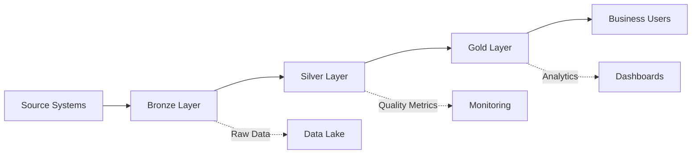

# 🏗️ TBWA Medallion Architecture Documentation

## Overview

The **Medallion Architecture** is a data design pattern that organizes data into three distinct layers: Bronze (raw), Silver (validated), and Gold (business-ready). This implementation transforms your existing enterprise data platform to follow this best practice.

## 📋 Table of Contents
- [Architecture Layers](#architecture-layers)
- [Data Flow](#data-flow)
- [ETL Pipeline](#etl-pipeline)
- [Data Quality](#data-quality)
- [Usage Guide](#usage-guide)
- [Monitoring](#monitoring)
- [Best Practices](#best-practices)

## 🥉🥈🥇 Architecture Layers

### Bronze Layer (Raw Data)
- **Purpose**: Store raw, unprocessed data exactly as received
- **Schemas**: `bronze_hr`, `bronze_financial`, `bronze_operations`, `bronze_creative`
- **Characteristics**:
  - No transformations applied
  - Includes source metadata (timestamps, origins)
  - Immutable historical record
  - Views over existing tables

```sql
-- Example: Bronze HR data
SELECT * FROM bronze_hr.employees_raw;
-- Returns raw employee data with ingestion metadata
```

### Silver Layer (Validated & Enriched)
- **Purpose**: Clean, validate, and enrich data with business rules
- **Schemas**: `silver_hr`, `silver_financial`, `silver_operations`, `silver_creative`
- **Characteristics**:
  - Data quality scoring (0-100%)
  - Validation flags
  - Business rule enforcement
  - Derived fields and enrichments

```sql
-- Example: Silver validated employees
SELECT 
    full_name,
    email,
    data_quality_score,
    is_valid_email,
    is_valid_salary
FROM silver_hr.employees_validated
WHERE data_quality_score >= 75;
```

### Gold Layer (Business Analytics)
- **Purpose**: Aggregated, business-ready analytics and KPIs
- **Schema**: `gold` (renamed from `analytics`)
- **Characteristics**:
  - Executive dashboards
  - Aggregated metrics
  - Cross-domain analytics
  - Real-time business insights

```sql
-- Example: Executive dashboard
SELECT * FROM gold.hr_executive_dashboard;
SELECT * FROM gold.financial_executive_dashboard;
SELECT * FROM gold.medallion_health_dashboard;
```

## 🔄 Data Flow



## 🚀 ETL Pipeline

### Automated Pipeline Execution
```sql
-- Run the complete medallion pipeline
SELECT etl.run_medallion_pipeline();
```

This orchestrates:
1. Bronze → Silver transformations
2. Data quality checks
3. Gold layer refresh
4. Metadata updates

### Individual ETL Functions
```sql
-- HR data pipeline
SELECT etl.bronze_to_silver_hr();

-- Financial data pipeline
SELECT etl.bronze_to_silver_financial();

-- Refresh materialized views
REFRESH MATERIALIZED VIEW gold.monthly_financial_summary;
```

### Pipeline Monitoring
```sql
-- Check ETL job status
SELECT 
    job_name,
    last_run_status,
    last_run_end,
    last_run_records_processed,
    error_message
FROM metadata.etl_jobs
ORDER BY last_run_end DESC;
```

## 📊 Data Quality

### Quality Scoring System
Each record in the Silver layer has a `data_quality_score` (0-100%):
- **75-100%**: High quality (recommended for analytics)
- **50-74%**: Medium quality (use with caution)
- **0-49%**: Low quality (requires attention)

### Quality Monitoring
```sql
-- Check overall data quality
SELECT * FROM quality.check_silver_data_quality();

-- Find low-quality records
SELECT * FROM silver_hr.employees_validated
WHERE data_quality_score < 75;
```

### Quality Rules
```sql
-- View active quality rules
SELECT * FROM metadata.data_quality_rules
WHERE is_active = true;
```

## 📖 Usage Guide

### For Analysts

1. **Always query from Gold layer for reports**:
```sql
-- Good: Use Gold layer views
SELECT * FROM gold.hr_executive_dashboard;

-- Avoid: Direct Bronze queries
SELECT * FROM bronze_hr.employees_raw; -- Only for debugging
```

2. **Filter by data quality when needed**:
```sql
-- Get only high-quality financial data
SELECT * FROM silver_financial.cash_advances_validated
WHERE data_quality_score >= 75
AND status = 'approved';
```

### For Developers

1. **Adding new data sources**:
```sql
-- 1. Create Bronze view
CREATE VIEW bronze_new.source_raw AS
SELECT *, NOW() as ingestion_timestamp
FROM source_schema.source_table;

-- 2. Create Silver table with validation
CREATE TABLE silver_new.source_validated (
    -- columns with validation rules
);

-- 3. Create ETL function
CREATE FUNCTION etl.bronze_to_silver_new() ...
```

2. **Data lineage tracking**:
```sql
-- Record transformation lineage
INSERT INTO metadata.data_lineage 
(source_schema, source_table, target_schema, target_table, transformation_type)
VALUES ('bronze_new', 'source_raw', 'silver_new', 'source_validated', 'bronze_to_silver');
```

## 📈 Monitoring

### Medallion Health Dashboard
```sql
-- Overall medallion architecture health
SELECT * FROM gold.medallion_health_dashboard;
```

This shows:
- Layer statistics (Bronze/Silver/Gold)
- ETL job status
- Average data quality scores
- Processing metrics

### Data Freshness
```sql
-- Check for stale data
SELECT * FROM metadata.data_freshness
WHERE is_stale = true;
```

### Performance Metrics
```sql
-- ETL performance analysis
SELECT 
    job_name,
    AVG(EXTRACT(EPOCH FROM (last_run_end - last_run_start))) as avg_duration_seconds,
    AVG(last_run_records_processed) as avg_records_processed
FROM metadata.etl_jobs
WHERE last_run_status = 'success'
GROUP BY job_name;
```

## 🎯 Best Practices

### 1. **Layer Isolation**
- Never skip layers (Bronze → Gold)
- Each layer has specific responsibilities
- Maintain clear boundaries

### 2. **Data Quality First**
- Set minimum quality thresholds
- Monitor quality trends
- Address quality issues at Silver layer

### 3. **Incremental Processing**
- Use incremental ETL where possible
- Track processing timestamps
- Handle late-arriving data

### 4. **Documentation**
- Document transformation logic
- Maintain data dictionaries
- Record business rules

### 5. **Access Control**
- Bronze: Restricted (admins only)
- Silver: Department-based access
- Gold: Role-based analytics access

## 🔧 Troubleshooting

### Common Issues

1. **ETL Pipeline Failures**
```sql
-- Check failed jobs
SELECT * FROM metadata.etl_jobs
WHERE last_run_status = 'failed'
ORDER BY last_run_end DESC;
```

2. **Data Quality Issues**
```sql
-- Identify quality problems
SELECT 
    schema_name,
    table_name,
    quality_percentage,
    quality_status
FROM quality.check_silver_data_quality()
WHERE quality_status IN ('poor', 'fair');
```

3. **Performance Issues**
```sql
-- Check slow ETL jobs
SELECT 
    job_name,
    last_run_end - last_run_start as duration,
    last_run_records_processed
FROM metadata.etl_jobs
WHERE (last_run_end - last_run_start) > INTERVAL '5 minutes';
```

## 🚀 Quick Start Commands

```bash
# Apply migrations
cd /Users/tbwa/supabase
./deploy_enterprise_migrations.sh

# Manual pipeline run
psql $DATABASE_URL -c "SELECT etl.run_medallion_pipeline();"

# Check health
psql $DATABASE_URL -c "SELECT * FROM gold.medallion_health_dashboard;"

# Monitor quality
psql $DATABASE_URL -c "SELECT * FROM quality.check_silver_data_quality();"
```

## 📊 Sample Queries

### Executive Analytics
```sql
-- Financial overview with data quality
SELECT 
    total_advances,
    total_approved_amount,
    high_quality_records,
    ROUND(high_quality_records::DECIMAL / total_advances * 100, 2) as quality_percentage
FROM gold.financial_executive_dashboard;
```

### Department Performance
```sql
-- HR metrics with validation
SELECT 
    department,
    employee_count,
    avg_salary,
    (SELECT AVG(data_quality_score) 
     FROM silver_hr.employees_validated e 
     WHERE e.department_id = d.id) as avg_data_quality
FROM gold.hr_executive_dashboard
CROSS JOIN LATERAL jsonb_array_elements(department_breakdown) as d;
```

### Data Lineage Trace
```sql
-- Track data journey
WITH RECURSIVE lineage AS (
    SELECT * FROM metadata.data_lineage
    WHERE target_table = 'hr_executive_dashboard'
    UNION ALL
    SELECT l.* FROM metadata.data_lineage l
    JOIN lineage ON l.target_schema = lineage.source_schema 
                AND l.target_table = lineage.source_table
)
SELECT * FROM lineage;
```

---

## 📞 Support

For questions or issues:
1. Check ETL logs in `metadata.etl_jobs`
2. Review data quality reports
3. Monitor the medallion health dashboard
4. Contact your data platform team

**Your data is now organized in a scalable, maintainable medallion architecture that ensures quality and reliability at every layer.** 🎉